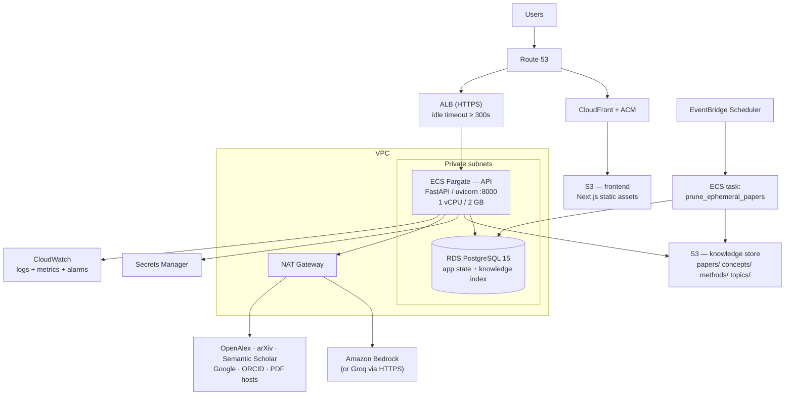

# SAIRA — Cloud Architecture (AWS)

The target deployment after the LLM-Wiki / OKF migration.

For the full pre-migration deployment audit — every component, risk, and
provider comparison — see `CLOUD_DEPLOYMENT_ARCHITECTURE.md`. This document
is narrower: what the architecture is *now*, and what it takes to run it.

---

## 1. What the migration removed

| Component | Before | After |
|---|---|---|
| Graph database | Neo4j 5 Community — chunks, 384-d vectors, concept + citation graphs | **gone** |
| Embedding model | `all-MiniLM-L6-v2` in-process, via sentence-transformers → torch | **gone** |
| API image weight | torch alone measures 537 MB; the venv 1.2 GB | no torch, no model weights |
| Runtime datastores | PostgreSQL **+** Neo4j | PostgreSQL |
| Model download at boot | Hugging Face fetch on first request | none |
| Cypher migration runner | `app/db/run_migrations.py` + 3 `.cypher` files | none — Alembic only |

Three deployment problems disappear with them: the API image no longer
carries a deep-learning stack, the container no longer needs egress to
Hugging Face at startup, and there is no longer a database with no managed
first-party equivalent and no clustering in its Community edition.

---

## 2. Target architecture



### Services and why each is here

| Service | Purpose | Why it is required |
|---|---|---|
| **S3 + CloudFront** | Frontend | The Next.js app is client-rendered; assets are static. `src/proxy.ts` middleware needs a Node/Edge runtime, so either deploy the standalone server to Fargate or run the middleware check client-side — see §5 |
| **ALB** | Public entry to the API | The browser calls the API directly (`credentials: "include"`); there is no BFF |
| **ECS Fargate** | API | Runs background compilation tasks between requests, so it cannot scale to zero per-request |
| **RDS PostgreSQL 15** | All application state **and** the knowledge index | No extensions needed. Full-text search is core Postgres |
| **S3** | Knowledge store | Compiled Markdown pages. `KNOWLEDGE_STORE_BACKEND=s3` |
| **Secrets Manager** | 6 secrets | §4 |
| **CloudWatch** | Logs, metrics, alarms | §6 |
| **EventBridge + ECS task** | Scheduled prune | Otherwise the knowledge store grows with every paper anyone merely opens |
| **Bedrock** *(or Groq)* | Generation | `LLM_PROVIDER=bedrock` selects it; see §3 |

### Deliberately absent

| Not used | Why |
|---|---|
| **Neo4j / Neptune** | The concept and citation graphs are one- and two-hop lookups; a relational join serves them. Removed in the migration |
| **OpenSearch** | Retrieval is Postgres full-text search over a GIN-indexed generated tsvector |
| **Any vector database** | No embeddings exist |
| **ElastiCache** | The only cross-instance state is job dedup, which a Postgres advisory lock covers. Add Redis when caching becomes the bottleneck, not before |
| **EKS** | Two services and one database |
| **SQS** | Ingestion is in-process. Add a queue when compilation moves to its own worker — see §7 |
| **GPU** | Nothing runs a model locally any more |

---

## 3. LLM provider

`app/services/llm_provider.py` is the only module that talks to a model.

```python
class LLMProvider(ABC):
    async def generate(model, messages, temperature, max_tokens) -> str
    async def generate_json(model, messages, ...) -> dict
    def model_for(role) -> str          # "primary" | "extraction"
```

- **`GroqProvider`** — current default. Delegates to `groq_service`, which
  carries the reasoning-model handling (chain-of-thought billed against
  `max_tokens`, the empty-content retry, the truncated-JSON retry, per-day vs
  per-minute 429 handling).
- **`BedrockProvider`** — the AWS path. Uses the Anthropic SDK's
  `AnthropicBedrockMantle` client; model IDs take the `anthropic.` prefix.

Switching is `LLM_PROVIDER=bedrock` plus `pip install anthropic`. No other
module changes.

> **Not verified.** There are no AWS credentials in this environment, so
> `BedrockProvider` has never made a live call. Treat it as unexercised until
> someone runs it against a real account. `GroqProvider` is what all testing
> ran against.

**Rate limits are the real capacity ceiling.** They are account-wide, so they
do not scale with replicas. `KNOWLEDGE_COMPILE_CONCURRENCY` exists because two
concurrent compilations on an 8,000 TPM tier both failed; on Bedrock, size
this against your provisioned throughput.

---

## 4. Configuration and secrets

**Secrets Manager** (rotatable, injected at runtime):

`JWT_SECRET_KEY` · `SESSION_SECRET_KEY` · `GROQ_API_KEY` (or Bedrock IAM
role) · `GOOGLE_CLIENT_SECRET` · `ORCID_CLIENT_SECRET` · the password inside
`DATABASE_URL`

**Task environment** (non-secret):

`ENVIRONMENT=production` · `DEBUG=false` · `BACKEND_CORS_ORIGINS` ·
`FRONTEND_URL` · `BACKEND_PUBLIC_URL` · `COOKIE_DOMAIN` ·
`KNOWLEDGE_STORE_BACKEND=s3` · `KNOWLEDGE_S3_BUCKET` · `LLM_PROVIDER` ·
`BEDROCK_REGION` · the `RAG_*` and `KNOWLEDGE_COMPILE_*` knobs ·
`SAIRA_EVAL_MODE=false` · `SAIRA_LOG_LLM_PAYLOAD=false`

**Build-time (frontend):** `NEXT_PUBLIC_API_URL` is baked into the bundle, so
each environment needs its own build.

`NEO4J_URI`, `NEO4J_USER`, `NEO4J_PASSWORD` are **no longer read** and can be
deleted from every environment.

---

## 5. Networking

Public: CloudFront (frontend), ALB (API). Private: Fargate tasks, RDS.
Outbound through NAT.

**A hard constraint carried over from before the migration:** auth cookies
are `SameSite=Lax`, so the frontend and API must be **same-site**. Deploy them
as `app.example.com` and `api.example.com` with `COOKIE_DOMAIN=.example.com`.
Split across unrelated domains, the browser will not send the cookie and
nobody can log in — and it fails at the very end of a migration, after
everything else looks fine.

`cookie_secure` is on whenever `ENVIRONMENT != development`, so TLS is
mandatory in staging and production.

---

## 6. Observability

Present in the code: structured `key=value` events (`indexing_started`,
`knowledge_compiled`, `knowledge_compilation_degraded`,
`indexing_job_deduplicated`, `sync_job_deduplicated`, scope-violation ERRORs),
`RetrievalResult.to_log()` with scope, entry ids, scores and latency, and
`ScopedAnswer` carrying `prompt_chars` and `generation_latency_ms`.

Still to add before production: `logging.dictConfig` with a JSON formatter
(the events exist but are not machine-parseable), request IDs propagated into
background tasks, and a `GET /ready` that checks the database.

Alarms worth having:

| Alarm | Why |
|---|---|
| `RetrievalResult.error` rate | The difference between grounded answers and blanket abstention |
| `knowledge_compilation_degraded` rate | Papers landing without a wiki page |
| Papers with `degraded: true` | Backlog needing a retry |
| LLM 429 rate, split per-minute vs per-day | The real capacity ceiling |
| `indexing_status='failed'` count | Extraction problems |

---

## 7. Scaling path

**Today:** one Fargate task. `KNOWLEDGE_COMPILE_CONCURRENCY=1` makes that
correct rather than merely tolerated — the compilation gate and the indexing
dedup registry are both in-process.

**To run more than one task**, in order:

1. Move `indexing_jobs._running` dedup to a **Postgres advisory lock** keyed
   on the paper UUID. The module's docstring already names this.
2. Make the compile gate cross-process, or move ingestion out entirely (below).
3. Confirm avatar uploads are on S3 — `avatar_service.py` still writes local
   disk, and it is the last per-instance filesystem dependency.

**When ingestion needs its own capacity:** extract `research_indexer` +
`knowledge_compiler` behind SQS and run them as a separate Fargate service.
The API then only enqueues. This also removes PDF parsing from the
request-serving container. It was not done here because it is not yet needed
and the brief asked not to add infrastructure that testing has not justified.

**Retrieval** scales with Postgres. The GIN index over `search_vector` is the
hot path; watch `knowledge_entries` row count and RDS CPU.

---

## 8. Deployment steps

```bash
# 1. Migrate the schema (Alembic only — no Cypher runner any more)
cd backend && alembic upgrade head

# 2. Reconcile papers indexed by the old pipeline. They claim `indexed` but
#    have no compiled knowledge, so Ask AI would be offered and answer from
#    nothing. This resets them to recompile on next use.
venv/Scripts/python.exe scripts/recompile_knowledge.py

# 3. Schedule the prune job (EventBridge → ECS task, daily)
venv/Scripts/python.exe scripts/prune_ephemeral_papers.py --days 7
```

## 9. Still required before production

These are unchanged from `CLOUD_DEPLOYMENT_ARCHITECTURE.md` and were **not**
in scope for this migration:

| Priority | Item |
|---|---|
| **P0** | No Dockerfile for either service; no CI/CD; no IaC |
| **P0** | `JWT_SECRET_KEY` / `SESSION_SECRET_KEY` default to `CHANGE_ME_IN_PRODUCTION` and boot without complaint (`config.py:_warn_on_default_secret` returns the value unchanged) |
| **P0** | SSRF: `POST /papers/` accepts an arbitrary `pdf_url` and the server fetches it with `follow_redirects=True`, no allowlist, no private-IP block. In a VPC that reaches instance metadata |
| **P0** | Avatars write to local disk (`avatar_service.py`) |
| **P1** | `POST /ai/prd` and `POST /comparisons/generate` accept a `project_id` without an ownership check |
| **P1** | No rate limiting anywhere |
| **P1** | No graceful shutdown — in-flight compilation dies on SIGTERM |
| **P1** | No Python lock file; dependencies pinned with `>=` only |

The migration made the architecture *simpler and cheaper to run*. It did not
make it *secure to expose*.
