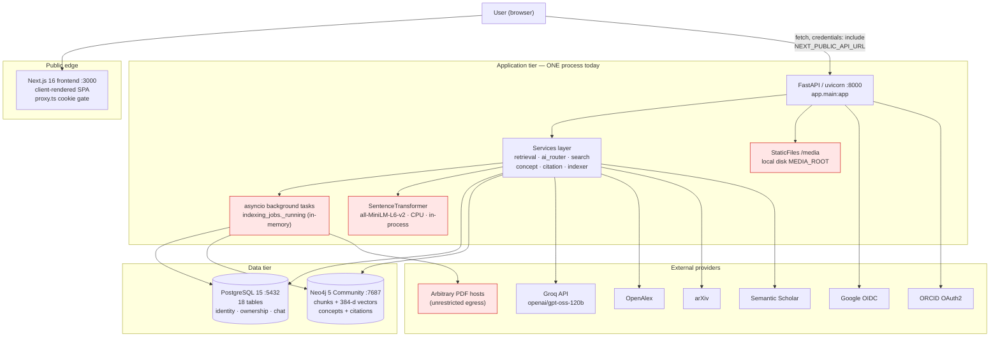
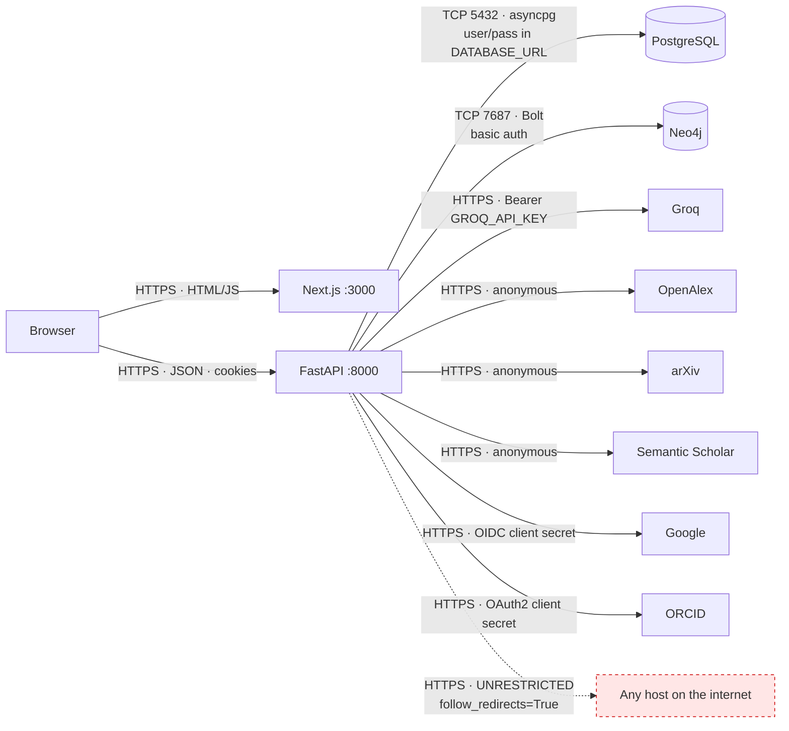
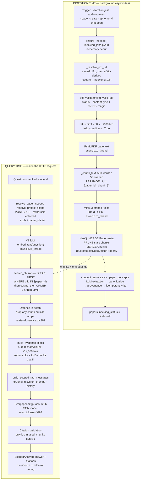
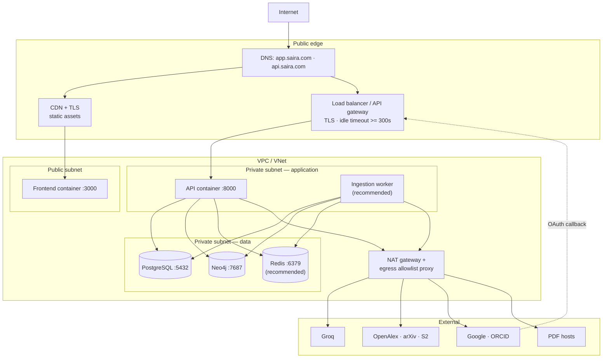
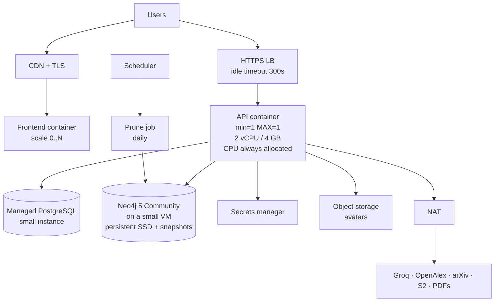
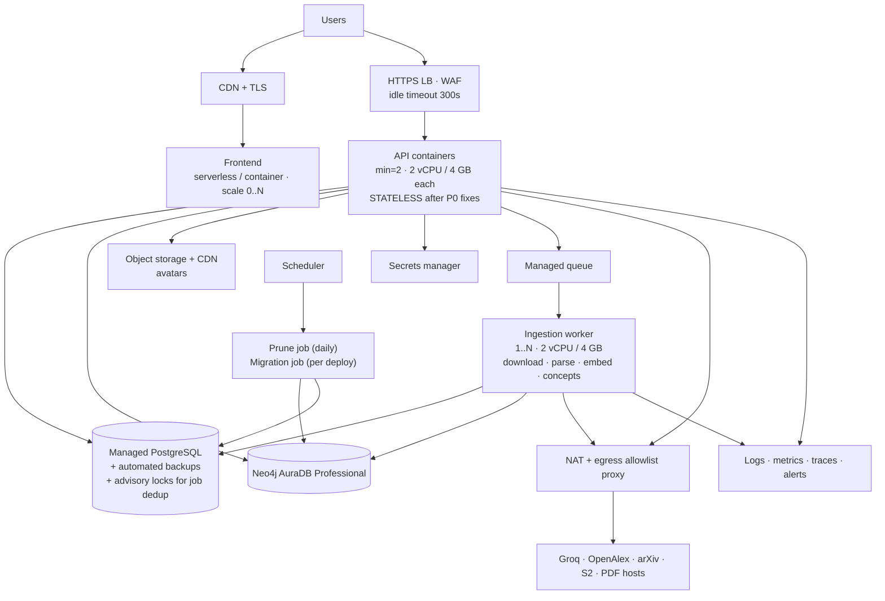
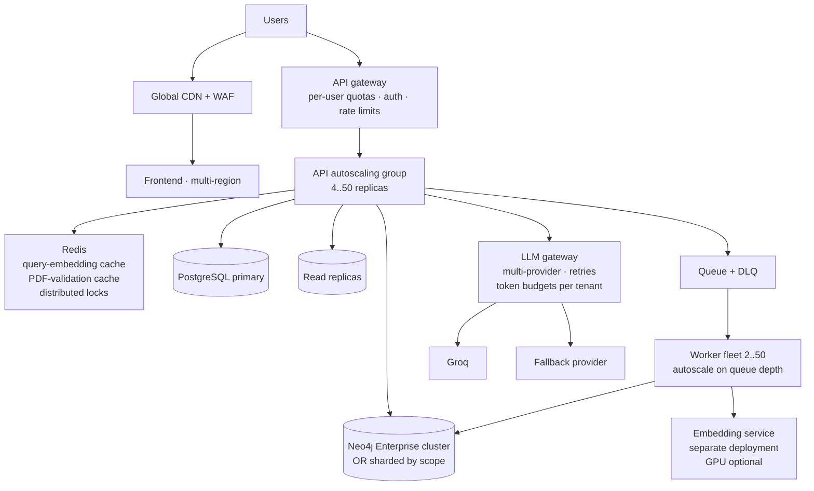
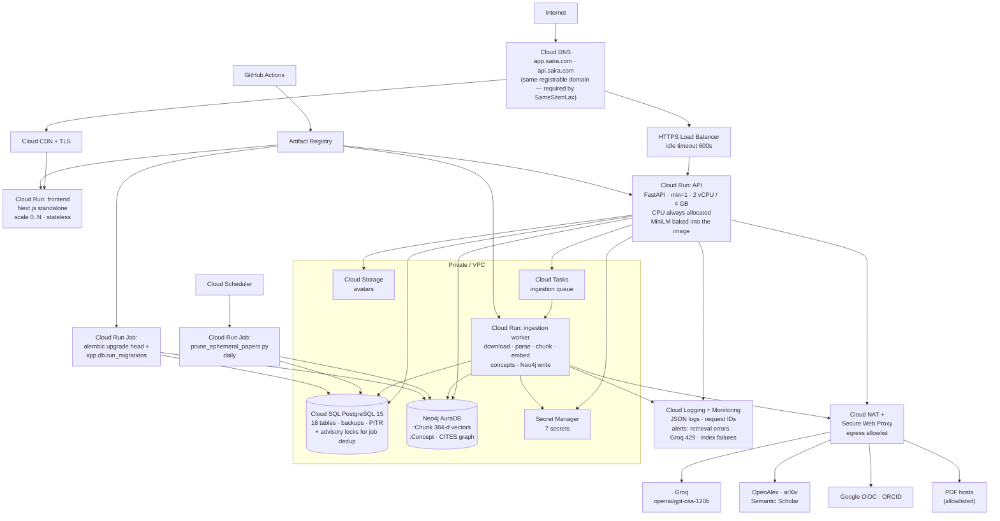

# SAIRA — Cloud Deployment Architecture Report

**Repository:** `saira` (branch `main`, commit `b464fc9`)
**Date:** 2026-09-08
**Scope:** deployment-oriented architecture extraction. No source code was modified.

### How to read this document

Every claim is tagged:

| Tag | Meaning |
|---|---|
| **FACT** | Directly observed in the repository. A file path (and line) is given. |
| **INFERENCE** | Derived from the code, but not stated anywhere. The reasoning is shown. |
| **RECOMMENDATION** | My proposal. Not present in the repository. |
| **UNKNOWN** | The repository provides no evidence either way. |

### Headline findings (read these first)

1. **FACT — there is no container image, no CI/CD, and no infrastructure-as-code in this repository.** `docker-compose.yml` contains only PostgreSQL and Neo4j; there is no Dockerfile for the API or the frontend, no `.github/`, no Terraform/Pulumi/Helm/Kubernetes manifests. Deployment maturity is **level 0: local development only**.
2. **FACT — the API server embeds a PyTorch model.** `backend/requirements.txt` pulls `sentence-transformers`, which pulls `torch` (measured: 537 MB in `backend/venv/Lib/site-packages/torch`; the whole venv is 1.2 GB). `all-MiniLM-L6-v2` is loaded lazily inside the API process (`backend/app/services/embedding_service.py:13`). This makes the image large, raises the memory floor, and couples embedding CPU to request-serving CPU.
3. **FACT — background work runs as bare `asyncio.create_task` inside the API process,** with an in-memory dedup registry (`backend/app/services/indexing_jobs.py:29`). Its own docstring says: *"in-process dedup only — one FastAPI worker. Move the registry to a Postgres advisory lock (or a real queue) if the API is ever run multi-process."* This is the single largest blocker to running more than one API replica.
4. **FACT — vector retrieval does not use the vector index.** `backend/neo4j_migrations/migrations/002_vector_index.cypher` creates `chunk_embeddings`, but `neo4j_service.search_chunks` (`backend/app/services/neo4j_service.py:125`) computes `vector.similarity.cosine(...)` inside a plain `MATCH`. This is a deliberate, documented correctness choice (scope-first ranking beats index-then-filter for recall and scope safety) but it is an O(chunks-in-scope) scan per question.
5. **FACT — server-side request forgery is reachable by any authenticated user.** `POST /api/v1/papers/` accepts an arbitrary `pdf_url` (`backend/app/schemas/paper.py:19` → `PaperBase`) and `create_paper` immediately calls `ensure_indexed` (`backend/app/api/v1/endpoints/papers.py:39`), which fetches that URL server-side with `follow_redirects=True` and no allowlist (`backend/app/services/research_indexer.py:92`, `backend/app/services/pdf_validator.py:66`). Inside a cloud VPC that reaches the instance metadata endpoint. **This is the biggest single deployment risk and it is P0.**
6. **FACT — two endpoints accept a `project_id` without an ownership check:** `POST /api/v1/ai/prd` (`backend/app/api/v1/endpoints/ai.py:209`; `prd_engine._build_workspace_context` filters only on `Project.id`, `backend/app/services/prd_engine.py:50`) and `POST /api/v1/comparisons/generate` (`backend/app/api/v1/endpoints/comparisons.py:71`). Chat and retrieval *do* enforce ownership correctly; these two do not.
7. **FACT — there is no rate limiting anywhere in the application.** The token-bucket limiter in `evaluation/common/throttle.py` is installed only by the evaluation harness — `grep -rn "throttle" backend/app/` returns nothing. The Groq free-tier ceiling (8,000 TPM, per `evaluation/common/throttle.py:4`) is an uncontrolled, account-wide bottleneck shared by every user.

---

# 1. SYSTEM OVERVIEW

## 1.1 Purpose

**FACT.** SAIRA ("Smart AI Research Assistant", `backend/README.md:1`) is a research-paper workspace. A user searches external scholarly databases, saves papers into projects and collections, reads them, and asks grounded questions about a single paper or a whole project. Answers come from retrieval-augmented generation over the paper's own text, with citations validated against the evidence actually sent to the model.

## 1.2 Major functional modules

**FACT** — from `backend/app/api/v1/router.py`:

| Module | Router prefix | Responsibility |
|---|---|---|
| Auth | `/auth` | register/login, JWT in HttpOnly cookies, refresh rotation, avatar upload |
| OAuth | `/auth/google`, `/auth/orcid` | Authlib OIDC / OAuth2 login |
| Projects | `/projects` | projects, project↔paper membership, notes, highlights, reading progress, saved artifacts, graphs |
| Papers | `/papers` | shared paper catalogue, indexing status, citation/concept/dependency subgraphs |
| Collections | `/collections` | lightweight paper groupings |
| Search | `/search` | external federated search + ingest |
| AI | `/ai` | summary, structured extraction, legacy QA, PRD, independent literature review |
| Chat | `/chat` | Paper Chat — persistent sessions, ephemeral mode, promotion |
| Project AI | `/projects/{id}/ai` | Project Chat + literature review lifecycle |
| Comparisons | `/comparisons` | multi-paper structured comparison |
| History / Analytics / Trending | `/history`, `/analytics`, `/trending` | activity feed and dashboards |

## 1.3 Backend architecture

**FACT.** FastAPI + SQLAlchemy 2.x async + `asyncpg`, one ASGI app (`backend/app/main.py`). Layering is `endpoints → services → (Postgres | Neo4j | Groq | HTTP clients)`. Middleware: `SessionMiddleware` for Authlib state/nonce (`main.py:23`) and `CORSMiddleware` (`main.py:26`). Global exception handlers normalise every error to `{"detail": ...}` (`backend/app/middleware/error_handler.py`). A `StaticFiles` mount serves `/media` from local disk (`main.py:40`).

## 1.4 Frontend architecture

**FACT.** Next.js 16.2.10 App Router, React 19.2.4, Tailwind 4, Radix UI, `react-force-graph-2d` for graph views. 45 of 65 components carry `"use client"`; the only non-client files are `src/app/layout.tsx`, `src/app/(app)/layout.tsx`, `src/app/page.tsx`.

**INFERENCE:** the frontend is effectively a client-rendered SPA served by Next. It performs no server-side data fetching, so the Next server never needs network reachability to the API — only the browser does.

**FACT.** The browser calls the API **directly** at `NEXT_PUBLIC_API_URL` (`frontend/src/lib/api/client.ts:20`, default `http://localhost:8000/api/v1`) with `credentials: "include"`. There is no BFF or proxy layer. `frontend/src/proxy.ts` is a Next 16 middleware that checks only for the *presence* of a `refresh_token` cookie; its docstring states the authoritative check is client-side against `/auth/me`.

## 1.5 AI/ML architecture

**FACT.**

| Role | Model | Where it runs |
|---|---|---|
| Generation (all tasks) | `openai/gpt-oss-120b` | Groq API (`backend/app/core/config.py:124-127`) |
| Embeddings | `all-MiniLM-L6-v2`, 384-dim | **In-process, on CPU** (`backend/app/services/embedding_service.py:15`) |
| Reranking | *none* | — |
| Speech / vision | *none* | — |

**FACT.** Every Groq call funnels through one client (`backend/app/services/groq_service.py`) which strips reasoning blocks, normalises errors, and distinguishes per-minute throttling from daily quota exhaustion (`groq_service.py:236-248`).

## 1.6 RAG architecture

**FACT.** One retrieval path serves both chat surfaces. `RetrievalScope` is resolved **server-side** from the database using the caller's `user_id`; the frontend never supplies a scope (`backend/app/services/retrieval_service.py:15-27`). Scope is applied inside the Cypher `MATCH` *before* ranking (`neo4j_service.py:125`). Citations are validated against the chunks that actually fit the context budget (`ai_router.answer_scoped`, `backend/app/services/ai_router.py:539-560`). Full detail in §7.

## 1.7 Data / knowledge architecture

**FACT.** Two stores with a deliberate split:

- **PostgreSQL** owns identity, ownership and authorization: 18 tables including `users`, `projects`, `project_papers`, `papers`, `chat_sessions`, `chat_messages`.
- **Neo4j** owns the knowledge graph and the vectors: `:Paper`, `:Chunk` (with `embedding`), `:Concept`, `:Method`, `:Dataset`, `:Author`, and `CITES` / `HAS_CHUNK` / `HAS_CONCEPT` relationships.

**FACT.** The join key is the PostgreSQL UUID, carried onto Neo4j `:Paper.id` (`neo4j_service.upsert_paper`, `neo4j_service.py:11-25`).

**INFERENCE:** this forces every retrieval to be a two-step — Postgres answers *"which papers may this user see?"*, Neo4j answers *"which chunks are most similar?"* That is what makes the scope boundary enforceable, and it also means the two databases are never joined and need no distributed transaction.

## 1.8 External integrations

**FACT:** Groq, OpenAlex (`https://api.openalex.org`), arXiv (`https://export.arxiv.org/api/query`), Semantic Scholar (`https://api.semanticscholar.org/graph/v1`), Google OIDC, ORCID OAuth2, plus **arbitrary HTTP(S) hosts** for PDF download.

## 1.9 Infrastructure components present in the repo

**FACT:** `docker-compose.yml` (Postgres 15-alpine + Neo4j 5-community with named volumes), Alembic migrations (`backend/alembic/versions/`, 10 revisions), a hand-rolled Cypher migration runner (`backend/app/db/run_migrations.py`), and two operational scripts (`backend/scripts/backfill_indexing.py`, `backend/scripts/prune_ephemeral_papers.py`).

**FACT:** nothing else. No Dockerfile, no CI, no IaC, no reverse-proxy config, no process-manager config.

## 1.10 Runtime architecture

**FACT.** Two long-running processes (`uvicorn app.main:app --port 8000`, `npm run dev` / `next start` on 3000) plus two databases (`README.md:202,237,271,275`). All ingestion, embedding, concept extraction and citation sync happen **inside the API process** as asyncio tasks.

## 1.11 High-level component diagram



The four red boxes are what breaks when you run more than one replica or move to an ephemeral filesystem. They drive most of §25.

---

# 2. REPOSITORY STRUCTURE

268 tracked files. `git ls-files` is the authority here; `backend/venv/` and `frontend/node_modules/` are untracked build artefacts, excluded except where their size matters.

## 2.1 Top level

| Path | Purpose | Runtime relevance | Required in prod? |
|---|---|---|---|
| `backend/` | FastAPI application | **The API** | Required |
| `frontend/` | Next.js application | **The UI** | Required |
| `evaluation/` | RAG/graph evaluation harness | Test-time only | **Excludable** |
| `docker-compose.yml` | Local Postgres + Neo4j | Local dev only | Excludable (replaced by managed DBs) |
| `pytest.ini` | Test discovery config | Test-time | Excludable |
| `check_servers.py` | 12-line port checker for 3000/8000 | Dev convenience | **Excludable** |
| `README.md` | Local dev setup guide | Docs | Excludable |
| `media/` | **Untracked runtime dir** for uploaded avatars (currently empty) | Runtime data | Must move to object storage — §12 |
| `.gitignore` | Excludes venv, node_modules, `.env`, eval outputs | Build-time | Excludable |

## 2.2 `backend/`

| Path | Purpose | Required in prod? | Notes |
|---|---|---|---|
| `app/main.py` | ASGI app, middleware, `/health`, `/media` mount | **Required** | Entry point |
| `app/core/config.py` | Pydantic `Settings` — all env vars | **Required** | Single source of configuration |
| `app/core/security.py` | Argon2id hashing, JWT create/decode | **Required** | |
| `app/core/cookies.py` | HttpOnly cookie helpers | **Required** | `SameSite=Lax`; `Secure` on when `ENVIRONMENT != development` |
| `app/core/oauth.py` | Authlib client registry | Required if OAuth enabled | |
| `app/api/deps.py` | `get_current_user` — bearer header or cookie | **Required** | |
| `app/api/v1/endpoints/*.py` | 14 route modules, ~80 endpoints | **Required** | §5 |
| `app/models/*.py` | 18 SQLAlchemy models | **Required** | |
| `app/schemas/*.py` | Pydantic request/response contracts | **Required** | |
| `app/services/*.py` | 30 service modules (~5,000 LOC) | **Required** | |
| `app/db/session.py` | Async engine + `get_db` | **Required** | `pool_size=5`, `max_overflow=10` |
| `app/db/neo4j_client.py` | Neo4j async driver singleton | **Required** | |
| `app/db/run_migrations.py` | Cypher migration runner | **Required at deploy time** | Must run before first use |
| `alembic/`, `alembic.ini` | Postgres migrations, 10 revisions | **Required at deploy time** | `env.py:25` injects `settings.DATABASE_URL`, overriding the placeholder in `alembic.ini:89` |
| `neo4j_migrations/migrations/*.cypher` | constraints, property indexes, vector index | **Required at deploy time** | |
| `scripts/backfill_indexing.py` | One-off backfill for pre-existing papers | Ops | Keep in repo, not needed in image |
| `scripts/prune_ephemeral_papers.py` | TTL cleanup of unsaved papers' chunks | **Ops — must be scheduled** | §15 |
| `requirements.txt` | 20 direct deps | **Required (build)** | No lock file — §17 |
| `.env.example` | Documented variable list | Docs | Excludable |
| `fix_alembic.py`, `inspect_db.py`, `write_ctx.py`, `test_api.py`, `test_db_papers.py`, `test_pydantic.py`, `test_search_service.py` | **Committed one-off dev/debug scripts at `backend/` root** | None | **Excludable** — and they break pytest collection when run from `backend/` |
| `tests/` | 4 unit test modules | Test-time | Excludable |

**FACT:** there is no `requirements.lock`, no `poetry.lock`, no pip-tools output, and every dependency is pinned with `>=` only. **Python builds are not reproducible.** `frontend/package-lock.json` does exist, so the frontend is.

## 2.3 `frontend/`

| Path | Purpose | Required in prod? |
|---|---|---|
| `src/app/**` | App Router pages (17 routes) | **Required** |
| `src/components/**` | 65 components (`ui/` primitives + `shared/` features) | **Required** |
| `src/lib/api/*.ts` | 12 typed clients over one `apiFetch` | **Required** |
| `src/lib/mock-data.ts` | Static fixtures | **INFERENCE: excludable** — confirm no page imports it first |
| `src/proxy.ts` | Next 16 middleware cookie gate | **Required** — forces a Node/Edge runtime; the app cannot be a pure static export |
| `src/contexts/auth-context.tsx` | Client auth state | **Required** |
| `next.config.ts` | **Empty config object** | Build — `output: "standalone"` is missing, §16 |
| `package-lock.json` | Reproducible install | **Required (build)** |
| `eslint.config.mjs`, `postcss.config.mjs`, `tsconfig.json` | Build-time only | Build |
| `AGENTS.md`, `CLAUDE.md`, `README.md` | Docs | Excludable |

## 2.4 `evaluation/`

**FACT.** Nine packages (`retrieval`, `grounding`, `concept_graph`, `leakage`, `ingestion`, `discovery`, `regression`, `config`, `common`) plus `run_evaluation.py` and `reports_builder.py`. `evaluation/common/bootstrap.py` forces `SAIRA_EVAL_MODE=true`. `evaluation/common/throttle.py` monkey-patches `groq_service.chat_complete` with an 8,000 TPM token bucket.

**FACT: excludable from the production image.** It imports `app.*`, but nothing under `app/` imports it.

---

# 3. RUNTIME COMPONENTS

Two processes must run today. A third and fourth are recommended (marked).

## 3.1 Backend API server

| Field | Value |
|---|---|
| **Component** | SAIRA API |
| **Purpose** | All business logic, auth, RAG, ingestion, background jobs |
| **Language** | Python (3.12/3.13 — `backend/README.md:18`) |
| **Framework** | FastAPI + Uvicorn |
| **Entry point** | `backend/app/main.py` → `app` |
| **Start command** | `uvicorn app.main:app --port 8000` (**FACT**, `README.md:271`; `--reload` is dev-only and must be dropped) |
| **Port / protocol** | 8000 / HTTP-1.1 (JSON + one multipart upload) |
| **Stateless?** | **NO — stateful in three ways.** (a) `indexing_jobs._running` dict (`indexing_jobs.py:29`); (b) `pdf_validator._validation_cache` TTL dict (`pdf_validator.py:14`); (c) avatar files on local disk (`avatar_service.py:74`). |
| **CPU** | **INFERENCE: 2 vCPU minimum.** Embedding is `asyncio.to_thread`-offloaded (`retrieval_service.py:247`) but still CPU-bound in-process; PDF parsing via PyMuPDF is likewise `to_thread` (`research_indexer.py:119`). One vCPU means an ingestion job starves query traffic. |
| **Memory** | **INFERENCE: 2 GB minimum, 4 GB recommended.** torch + a loaded MiniLM is roughly 0.6–1.0 GB resident; a 100 MB PDF (`_MAX_PDF_BYTES`, `research_indexer.py:24`) is read fully into memory (`resp.content`), then its page text and all chunk embeddings are held simultaneously. |
| **GPU** | **None required.** SentenceTransformer defaults to CPU; nothing in the repo requests CUDA. |
| **Persistent storage** | **Yes, today** — `MEDIA_ROOT` avatars. Removable (§25 P0-3). |
| **Env vars** | See §10 |
| **Secrets** | `JWT_SECRET_KEY`, `SESSION_SECRET_KEY`, `DATABASE_URL`, `NEO4J_PASSWORD`, `GROQ_API_KEY`, `GOOGLE_CLIENT_SECRET`, `ORCID_CLIENT_SECRET` |
| **External deps** | Postgres, Neo4j, Groq, OpenAlex, arXiv, Semantic Scholar, Google, ORCID, arbitrary PDF hosts |
| **Scaling** | **Cannot scale horizontally as written** — see §13.3 |
| **Serverless?** | **No.** Long-lived background tasks outlive the response; a scale-to-zero runtime kills them mid-index. Cold start would also reload torch. |
| **Container?** | **Yes** — but no Dockerfile exists; one must be written. |
| **Managed service?** | Yes, on any container platform (Cloud Run with min-instances ≥ 1, ECS/Fargate, Container Apps). |

## 3.2 Frontend server

| Field | Value |
|---|---|
| **Component** | SAIRA Web |
| **Purpose** | Serve the React SPA and run the `proxy.ts` route gate |
| **Language / framework** | TypeScript / Next.js 16.2.10 |
| **Entry point** | `frontend/package.json` scripts |
| **Start command** | `next build` then `next start` (**FACT**, `package.json:7-8`; `README.md:237` shows `npm run dev`, which is dev-only) |
| **Port / protocol** | 3000 / HTTP |
| **Stateless?** | **Yes, fully.** No server-side session, no local writes. |
| **CPU / memory** | **INFERENCE: 0.5 vCPU / 512 MB.** It only serves prebuilt assets and runs a cookie-presence check. |
| **GPU / storage** | None |
| **Env vars** | `NEXT_PUBLIC_API_URL` — **baked in at build time**, not runtime (`client.ts:20`) |
| **Secrets** | None |
| **Scaling** | Trivially horizontal; no sticky sessions |
| **Serverless?** | **Yes** — ideal for Vercel/Cloud Run/Static Web Apps/Amplify |
| **Container?** | Yes (needs `output: "standalone"` in `next.config.ts`) |

## 3.3 PostgreSQL

| Field | Value |
|---|---|
| **Purpose** | Identity, ownership, chat persistence, all relational state |
| **Version** | `postgres:15-alpine` (**FACT**, `docker-compose.yml:5`) |
| **Client** | SQLAlchemy 2.x async + `asyncpg` |
| **Port** | 5432 |
| **Stateful** | **Yes** — the system of record |
| **Sizing** | **INFERENCE: small.** Rows are metadata; no blobs. 2 vCPU / 4–8 GB serves the foreseeable load. |
| **Managed?** | **Yes — strongly recommended.** Nothing here uses a Postgres extension. |

## 3.4 Neo4j

| Field | Value |
|---|---|
| **Purpose** | Chunks + 384-d embeddings, concept graph, citation graph |
| **Version** | `neo4j:5-community` (**FACT**, `docker-compose.yml:19`) |
| **Client** | `neo4j` async driver ≥ 5.24 |
| **Ports** | 7687 (Bolt, used) / 7474 (HTTP browser, dev only) |
| **Stateful** | **Yes** |
| **Sizing** | Compose sets 512 MB pagecache, 1 GB max heap (`docker-compose.yml:22-24`). **INFERENCE:** the brute-force cosine scan is pagecache-sensitive; the whole embedding set should fit in pagecache. A 384-d float32 vector is ~1.5 KB, so 100k chunks ≈ 150 MB of vectors plus text — 2–4 GB pagecache is a safe production floor. |
| **Managed?** | Yes — Neo4j AuraDB, or self-managed on a VM/container with a persistent disk. **Note:** Community Edition supports only one database and has no clustering. |

## 3.5 RECOMMENDED — separate ingestion worker

Not present today; all ingestion runs inside the API. See §15 and §25 P0-1.

## 3.6 RECOMMENDED — scheduled prune job

**FACT:** `backend/scripts/prune_ephemeral_papers.py` exists and its docstring says *"a script on a schedule, not a background reaper. Run it from cron or Task Scheduler."* **FACT: nothing in the repository schedules it.**
---

# 4. ARCHITECTURE DEPENDENCY GRAPH

## 4.1 Diagram



## 4.2 Dependency table

| Source | Destination | Protocol / port | Purpose | Sync/async | Data transferred | Auth | Frequency | Latency sensitive |
|---|---|---|---|---|---|---|---|---|
| Browser | Next.js | HTTPS 443→3000 | Serve SPA shell + route gate | Request/response | HTML, JS bundles | `refresh_token` cookie presence only | Every page load | Medium |
| Browser | FastAPI | HTTPS 443→8000 | All data and AI operations | Request/response | JSON; one multipart avatar upload | HttpOnly `access_token` cookie, or `Authorization: Bearer` | Every interaction | **High** |
| FastAPI | PostgreSQL | TCP 5432 (asyncpg) | Identity, ownership, chat, metadata | Sync per request | Small rows | Password in `DATABASE_URL` | Multiple per request | **High** |
| FastAPI | Neo4j | TCP 7687 (Bolt) | Vector search, concept/citation graphs, chunk writes | Sync per request | Query: 384 floats. Response: up to 10 chunks × ≤2,000 chars. Ingest write: **all chunks + all embeddings in one `UNWIND`** | Basic (`NEO4J_USER`/`NEO4J_PASSWORD`) | Every chat turn; bulk on ingest | **High** for chat, low for ingest |
| FastAPI | Groq | HTTPS 443 | Generation, extraction, concept extraction | Sync — **client blocks on it** | Prompt up to ~12 KB evidence + history; `max_tokens=4096` | `GROQ_API_KEY` | Every chat turn, every ingest, every AI feature | **Very high — dominates p95** |
| FastAPI | OpenAlex / arXiv / Semantic Scholar | HTTPS 443 | Federated search + metadata ingest | Sync | Search JSON / Atom XML | Anonymous | Every search | **High** (user waits) |
| FastAPI (bg) | Arbitrary PDF host | HTTPS 443 | Download the paper PDF | Async background | Up to 100 MB | None | Once per paper | Low |
| FastAPI | Google / ORCID | HTTPS 443 | OAuth login | Sync, redirect flow | Tokens, profile | Client ID + secret | Per login | Medium |
| Ops | PostgreSQL / Neo4j | 5432 / 7687 | Migrations, prune job | Batch | Schema DDL; `DETACH DELETE` | Same as API | Per deploy / daily | Low |

**FACT — latency reality check.** In `POST /chat/sessions/{id}/messages` and `POST /projects/{id}/ai/chat` the entire chain runs *inside one HTTP request*: embed query (CPU) → Neo4j scan → Groq generation → two Postgres inserts. **INFERENCE:** with a reasoning model at `max_tokens=4096`, p95 will be tens of seconds. Any load balancer, API gateway or proxy in front of this needs an idle timeout well above the default 30–60 s. See §5.4 and §24 R-6.

---

# 5. API ARCHITECTURE

**FACT:** ~80 endpoints across 14 routers, all under `/api/v1` (`config.py:29`). Every endpoint except the OAuth entry points and `/health` depends on `get_current_user` (`backend/app/api/deps.py:23`).

## 5.1 Endpoint groups

| Group | Endpoints | Auth | Sync/async | DB deps | External | CPU | Timeout risk |
|---|---|---|---|---|---|---|---|
| `POST /auth/register`, `/login` | 2 | Public | Sync | PG | — | **Medium** — Argon2id is deliberately memory-hard | Low |
| `POST /auth/refresh`, `/logout`, `GET/PATCH /auth/me` | 5 | Cookie/bearer | Sync | PG | — | Low | Low |
| `POST /auth/me/avatar` | 1 | Required | Sync | PG + **local disk** | — | Medium (Pillow decode + LANCZOS resize) | Low. **Upload, ≤5 MB** (`config.py:78`) |
| `GET /auth/google/*`, `/orcid/*` | 4 | Public (redirect) | Sync | PG | Google, ORCID | Low | Medium |
| Projects / collections / papers CRUD | ~30 | Required | Sync | PG | — | Low | Low |
| `GET /papers/{id}/citations`, `/concepts`, `/research-map`, `/similar`, `/dependencies` | 5 | Required | Sync **+ fires background task on empty** | PG + Neo4j | Groq (background) | Low inline | Low |
| `GET /search/` | 1 | Required | Sync | PG | **3 external APIs** | Low | **High — external latency** |
| `POST /search/ingest` | 1 | Required | Sync + **queues ingestion** | PG + Neo4j | External + PDF host | Low inline | Medium |
| `POST /chat/sessions/{id}/messages` | 1 | Required | Sync | PG + Neo4j | **Groq** | **High** (query embed) | **Very high** |
| `POST /chat/papers/{id}/ephemeral` | 1 | Required | Sync, writes nothing | PG + Neo4j | **Groq** | **High** | **Very high** |
| `GET /chat/papers/{id}/context` | 1 | Required | Sync + **may queue ingestion** | PG | — | Low | Low |
| `POST /projects/{id}/ai/chat` | 1 | Required | Sync | PG + Neo4j | **Groq** | **High** | **Very high** |
| `POST /ai/summary`, `/extract`, `/qa`, `/prd` | 4 | Required | Sync | PG (+Neo4j for qa) | **Groq** | Medium | **Very high** |
| `POST /ai/review`, `/projects/{id}/ai/review/generate` | 3 | Required | Sync | PG | **Groq × (N papers + 1)** | Medium | **EXTREME** |
| `POST /comparisons/generate` | 1 | Required | Sync | PG | **Groq**, `max_tokens=4096` | Medium | **Very high** |
| `GET /history`, `/analytics`, `/trending` | 4 | Required | Sync | PG | — | Low | Low |
| `GET /health` | 1 | **Public** | Sync | **None** | — | Nil | Nil |

## 5.2 The expensive endpoints, ranked

1. **`POST /projects/{id}/ai/review/generate`** (`project_ai.py:200`) — **FACT:** `literature_review_service` fans out `ai_router.analyze_paper_for_review` over every paper in batches via `asyncio.gather` (`literature_review_service.py:24-29`), then makes one more synthesis call (`:87`). **INFERENCE:** a 20-paper project is 21 Groq calls in one HTTP request. At Groq free-tier TPM this alone can exceed several minutes, and it will 429 partway. **This endpoint must be made asynchronous before production.**
2. **`POST /comparisons/generate`** — up to 5 papers, one large JSON completion.
3. **The three chat endpoints** — embed + Neo4j scan + one Groq call each.
4. **`POST /ai/prd`** — builds a whole workspace context then calls Groq.
5. **`GET /search/`** — fans out to three external APIs; the user waits.

## 5.3 Legacy path worth flagging

**FACT:** `POST /ai/qa` (`ai.py:173`) calls `ai_router.answer_question`, which has its **own** inline retrieval and its **own** budget constants (`MAX_TOTAL_CONTEXT_CHARS = 10000`, `MAX_HISTORY_MESSAGES = 4`, `ai_router.py:140-146`) and performs **no citation validation**. Neither chat surface uses it, but it is routed and live. **RECOMMENDATION:** remove it or route it through `answer_scoped` before exposing the API publicly.

## 5.4 Transport requirements

| Requirement | Present? | Evidence |
|---|---|---|
| Long-running requests | **YES — up to several minutes** | §5.2. Set LB/gateway idle timeout ≥ 300 s |
| Streaming responses | **No** | `groq_service.chat_complete` never sets `stream=True` |
| WebSockets | **No** | No `websocket` route anywhere |
| Server-Sent Events | **No** | Indexing progress is polled via `GET /papers/{id}/indexing-status` (`papers.py:62`) |
| Background processing | **YES** | `asyncio.create_task` in `indexing_jobs.py:75`, `papers.py:178,214`, `search_service.py:504` |
| File uploads | **YES — one** | `POST /auth/me/avatar`, ≤5 MB, `python-multipart` |
| Large payloads | **Inbound: no.** **Outbound to Neo4j: yes** — a whole paper's chunks + embeddings in one `UNWIND` (`research_indexer.py:_store_chunks_in_neo4j`) |

---

# 6. DATABASE ARCHITECTURE

## 6.1 PostgreSQL — FACT

| Attribute | Value |
|---|---|
| Technology / version | PostgreSQL, `postgres:15-alpine` in compose |
| Client library | SQLAlchemy 2.x async + `asyncpg>=0.30` |
| Connection | `DATABASE_URL=postgresql+asyncpg://…` (`config.py:41`) |
| Pooling | `pool_size=5`, `max_overflow=10`, `pool_pre_ping=True` (`db/session.py:16-22`) → **max 15 connections per API process** |
| Auth | Username/password embedded in the URL |
| Migrations | Alembic, async `env.py`, 10 revisions |
| Transactions | Yes — ORM sessions, `expire_on_commit=False`, `autoflush=False` |

**Tables (18) — FACT, from `__tablename__`:**
`users`, `refresh_tokens`, `projects`, `papers`, `project_papers`, `collections`, `collection_papers`, `chat_sessions`, `chat_messages`, `comparisons`, `comparison_papers`, `notes`, `highlights`, `reading_progress`, `paper_analyses`, `literature_reviews`, `saved_artifacts`, `user_history`.

**Read/write pattern — INFERENCE:** read-heavy. Writes are small and bursty (a chat turn writes two `chat_messages` rows; ingestion updates one `papers.indexing_status` per state transition — 3–4 updates per paper).

**Indexes — FACT.** Declared: `papers.doi`/`arxiv_id`/`semantic_scholar_id` UNIQUE; `users.email`; `refresh_tokens.user_id` and `token_hash`; `user_history.event_type`/`created_at`; UNIQUE on `paper_analyses.paper_id` and `literature_reviews.project_id`.

**FACT — missing indexes on hot paths:**
- `project_papers(project_id)` and `project_papers(paper_id)` — hit on **every** project-chat scope resolution (`retrieval_service.py:181`) and on the persistence check for **every** paper-chat open (`chat.py:_is_paper_saved`).
- `chat_sessions(user_id, paper_id)` — hit on every paper-chat open.
- `papers.indexing_status` — scanned by the prune script.
- `Paper.title` has no text index, yet `search_service` filters with `Paper.title.ilike(...)` (`search_service.py:257,397,465`) → sequential scan on every dedup check.

**INFERENCE:** these are cheap wins and become real at a few hundred thousand rows. Foreign keys do **not** create indexes automatically in Postgres.

**Persistence:** required. **Backup:** required — this is the only copy of user accounts, projects and chat history. **HA:** **RECOMMENDATION** — single-AZ is acceptable for MVP; multi-AZ for production. **Managed cloud DB suitable: yes, unreservedly.** No extensions, no superuser operations, no `LISTEN/NOTIFY`.

## 6.2 Neo4j — FACT

| Attribute | Value |
|---|---|
| Technology / version | Neo4j 5 **Community Edition** |
| Client | Official `neo4j` async driver ≥ 5.24 |
| Connection | `bolt://…`, singleton `AsyncDriver` (`db/neo4j_client.py:44`) |
| Pooling | Driver default. **FACT: not configured anywhere** |
| Auth | Basic (`NEO4J_USER` / `NEO4J_PASSWORD`) |
| Migrations | Custom runner (`db/run_migrations.py`) that splits `.cypher` files on `;` and records applied migrations as `:Migration` nodes |

**Nodes:** `:Paper`, `:Chunk`, `:Concept`, `:Method`, `:Dataset`, `:Author`, `:Migration`.
**Relationships:** `HAS_CHUNK`, `CITES`, `HAS_CONCEPT`, `USES_METHOD`, `USES_DATASET`, `AUTHORED_BY`.

**Constraints and indexes — FACT:**
- `001_initial_constraints.cypher`: uniqueness on `Paper.id`, `Author.id`, `Method.id`, `Dataset.id`, `Concept.id`.
- `002_paper_indexes.cypher`: property indexes on `Paper.doi`, `arxiv_id`, `semantic_scholar_id`, `title`, `publication_year`, plus name indexes on Author/Method/Dataset/Concept.
- `002_vector_index.cypher`: `CREATE VECTOR INDEX chunk_embeddings FOR (c:Chunk) ON (c.embedding)`, `vector.dimensions: 384`, `vector.similarity_function: 'cosine'`. The same statement is re-executed defensively at ingest (`research_indexer.py:206`).

**FACT — there is no uniqueness constraint on `Chunk.id`,** although chunk IDs are deterministic (`{paper_id}_chunk_{i}`) and written with `MERGE`. **INFERENCE:** `MERGE` on an unconstrained property does an index-free scan and is not concurrency-safe; add `CREATE CONSTRAINT chunk_id … REQUIRE c.id IS UNIQUE`.

**FACT — the vector index is created but not used for retrieval.** `search_chunks` (`neo4j_service.py:125`) runs:

```cypher
MATCH (p:Paper)-[:HAS_CHUNK]->(chunk:Chunk)
WHERE p.id IN $paper_ids AND chunk.embedding IS NOT NULL
WITH chunk, p, vector.similarity.cosine(chunk.embedding, $embedding) AS score
WHERE score IS NOT NULL
ORDER BY score DESC
LIMIT $top_k
```

The docstring explains why: querying the global index and filtering afterwards can return fewer than *k* in-scope results, which is both a recall bug and a scope-leak risk. **INFERENCE — the cost:** this is a full similarity computation over every chunk of every in-scope paper on every question. A 30-page paper yields roughly 60–120 chunks, so paper chat is cheap; a 50-paper project is 3,000–6,000 cosine computations per turn. That is fine at this scale and becomes the retrieval bottleneck somewhere in the low tens of thousands of chunks per scope. See §22-C for the upgrade path.

**Read/write:** read-heavy at query time; write-heavy in bursts at ingest.
**Persistence and backup: required** — chunk embeddings are expensive to recompute, though they *are* fully reconstructible from the source PDFs.
**HA:** **FACT — Community Edition has no clustering.** A single instance with a persistent disk is the only option without an Enterprise licence or AuraDB.

## 6.3 Storage systems that are NOT present

**FACT — verified absent from the entire repository:**

| System | Present? | Note |
|---|---|---|
| Redis / Memcached | **No** | Caching is two in-process Python dicts. **This is the main multi-replica blocker.** |
| MongoDB | No | |
| Elasticsearch / OpenSearch | No | Text search is `ILIKE` against Postgres |
| Dedicated vector DB (Pinecone/Qdrant/pgvector/Weaviate) | No | Vectors live in Neo4j |
| SQLite | No | |
| Object/blob storage (S3/GCS/Blob) | **No** | Avatars go to local disk — §12 |
| Message queue / broker | **No** | Background work is bare asyncio |

## 6.4 In-process state (behaves like an unbacked cache)

| Location | Contents | Bound | Consequence of a restart or a second replica |
|---|---|---|---|
| `indexing_jobs._running` (`:29`) | `paper_id → asyncio.Task` | Unbounded (self-clearing) | **Two replicas index the same paper twice, concurrently.** The code acknowledges this. |
| `pdf_validator._validation_cache` (`:14`) | `url → (timestamp, result)`, 24 h valid / 1 h invalid TTL | Crude — drops 2,000 entries above 10,000 (`:29`) | Cache miss storm; duplicated outbound HEAD-ish probes |
| `EmbeddingService._model` (`:9`) | The loaded MiniLM | One | Reloaded per process — first request after start is slow |
| `GroqService._client` (`:107`) | AsyncGroq client | One | Harmless |

---

# 7. RAG ARCHITECTURE

## 7.1 Lifecycle diagram



## 7.2 Stage table

| Stage | Code location | Model / provider | Compute | Storage | Network | Sync? | When |
|---|---|---|---|---|---|---|---|
| Trigger / dedup | `indexing_jobs.py:38` | — | Nil | Postgres row | — | Async task | Ingest |
| PDF resolution | `research_indexer.py:167` | — | Nil | — | **Outbound to any host** | Async | Ingest |
| PDF validation | `pdf_validator.py:40` | — | Nil | In-process TTL dict | Outbound | Async | Ingest |
| PDF download | `research_indexer.py:92` | — | Nil | **Up to 100 MB in RAM** | Outbound | Async | Ingest |
| Parsing | `research_indexer.py:230` (`_extract_and_chunk`) | PyMuPDF | **CPU-heavy** | — | — | `to_thread` | Ingest |
| Chunking | `research_indexer.py:29` (`_chunk_text`) | 500 words / 50 overlap, **per page** | Trivial | — | — | Sync | Ingest |
| Metadata | `research_indexer.py:130` | page number, chunk index, deterministic id | Trivial | — | — | Sync | Ingest |
| Embedding (docs) | `embedding_service.py:22` | **all-MiniLM-L6-v2, local CPU** | **CPU-heavy, batch** | — | **None — local** | `to_thread` | Ingest |
| Vector storage | `research_indexer.py:_store_chunks_in_neo4j` | `db.create.setNodeVectorProperty`, fallback plain `SET` | Low | **Neo4j** | Bolt, large payload | Async | Ingest |
| Graph extraction | `concept_service.sync_paper_concepts` | **Groq** `GROQ_EXTRACTION_MODEL` | Low local | — | Outbound | Async | Ingest |
| Graph storage | `neo4j_service.upsert_concepts` | — | Low | Neo4j | Bolt | Async | Ingest |
| Scope resolution | `retrieval_service.py:139,168` | — | Trivial | **Postgres** | 5432 | Sync | **Query** |
| Embedding (query) | `retrieval_service.py:247` | **all-MiniLM-L6-v2, local CPU** | **CPU per question** | — | None | `to_thread` | **Query** |
| Vector search | `neo4j_service.py:125` | `vector.similarity.cosine` **scan** | Neo4j CPU | Neo4j | Bolt | Sync | **Query** |
| Reranking | **NONE** | — | — | — | — | — | — |
| Context construction | `retrieval_service.build_evidence_block` | ≤2,000 chars/chunk, ≤12,000 total | Trivial | — | — | Sync | **Query** |
| Generation | `ai_router.answer_scoped:529` | **Groq `openai/gpt-oss-120b`** | **Provider** | — | Outbound, dominant latency | Sync | **Query** |
| Citation validation | `ai_router.py:539-560` | — | Trivial | — | — | Sync | **Query** |

## 7.3 Design properties worth carrying into the deployment

- **FACT — retrieval strategy is dense-only.** No hybrid search, no BM25, no reranker. (The `project_chat` docstring at `project_ai.py:95` still says "BM25 retrieval: rank top-5 papers" — that comment is **stale**; the code calls `retrieval_service.retrieve`.)
- **FACT — metadata filtering is the scope itself**, applied as `WHERE p.id IN $paper_ids` inside the `MATCH`.
- **FACT — no retrieval cache.** Every question re-embeds and re-scans. **RECOMMENDATION:** a query-embedding cache keyed on the question string is the single cheapest latency win, and it needs Redis to work across replicas.
- **FACT — conversation memory is bounded centrally:** `RAG_MAX_HISTORY_MESSAGES = 6` enforced in `answer_scoped` (`ai_router.py:496`) so no caller can pass an unbounded transcript. Persistent paper chat and project chat load history from Postgres; ephemeral paper chat receives it from the client and re-validates it (`ChatTurn`, max 8,000 chars per turn).
- **FACT — a live misconfiguration.** `RAG_TOP_K_PROJECT = 10` but `RAG_MAX_CONTEXT_CHARS = 12000` with `RAG_MAX_CHUNK_CHARS = 2000`. **INFERENCE:** with realistically sized chunks the budget admits roughly 5–6 blocks, so project chat retrieves 10 chunks and sends about half. The extra retrieval work is wasted. Not a deployment blocker; worth a decision.

## 7.4 Ephemeral vs persistent paper chat (affects capacity planning)

**FACT.** A paper chat is persistent if and only if the paper is saved in one of the caller's projects — derived from `project_papers`, not stored as a flag (`chat.py`, `_is_paper_saved`). Opening an unsaved paper still runs the **full canonical ingestion pipeline** (`chat.py:409` calls `ensure_indexed`) so the ephemeral chat has something to answer from.

**INFERENCE — the capacity consequence:** browsing behaviour, not saving behaviour, drives ingestion cost. Every paper a user merely opens costs a PDF download, a full parse, an embedding pass, an LLM concept-extraction call, and permanent Neo4j storage until pruned. `backend/scripts/prune_ephemeral_papers.py` (default TTL 7 days) is the only thing that reclaims it, and **nothing schedules it**. Left unscheduled, Neo4j grows without bound.

---

# 8. AI / ML MODEL DEPENDENCIES

## 8.1 External managed APIs

### `openai/gpt-oss-120b` on Groq

| Attribute | Value |
|---|---|
| Provider | Groq (`GROQ_API_KEY`) |
| Configured as | `GROQ_PRIMARY_MODEL` **and** `GROQ_EXTRACTION_MODEL` — both default to the same model (`config.py:126-127`) |
| Used for | QA, summary, comparison, recommendation, research gap, project chat, scoped RAG, concept extraction, literature review, PRD, structured extraction (`ai_router._get_routing_table`, `:62-88`) |
| Input | System + evidence + history messages; evidence capped at 12,000 chars |
| Output | JSON (`chat_complete_json`) or prose; `max_tokens=4096` for scoped RAG |
| Context window | **UNKNOWN** — never asserted in the repo. The app self-limits well below any plausible limit. |
| GPU/CPU/RAM locally | **None** — fully remote |
| Latency | **UNKNOWN precisely.** `ScopedAnswer.generation_latency_ms` is measured and returned, so it is observable in production. |
| Rate limits configured | **FACT: none in the application.** `evaluation/common/throttle.py:4` documents 8,000 TPM on the free tier and implements a bucket **only for the harness**. `groq_service.py:236-248` handles 429s and distinguishes per-day quota exhaustion. |
| Cost | Per-token, per Groq's pricing. **UNKNOWN** — no pricing constant in the repo. |
| Swappable? | **Yes, cleanly.** One env var, one client module. Any OpenAI-compatible provider is a small change. |

**FACT — a cost trap specific to this model.** `groq_service.chat_complete` documents that `openai/gpt-oss-120b` is a **reasoning** model whose chain of thought is billed against `max_tokens` and returned in a separate `reasoning` field. When the budget is exhausted mid-reasoning the API returns HTTP 200 with **empty content** and `finish_reason="length"`; the code retries once with a doubled budget up to `_MAX_TOKEN_CEILING = 8192` (`groq_service.py:64,167-186`). **INFERENCE:** a single user question can cost up to ~12,288 output tokens (4,096 + 8,192) if it triggers the retry. Budget for that.

## 8.2 Self-hosted models

### `all-MiniLM-L6-v2` (sentence-transformers)

| Attribute | Value |
|---|---|
| Provider | Hugging Face, via `sentence-transformers>=3.0.1` |
| API or local | **LOCAL — inside the API process** (`embedding_service.py:15`) |
| Size | ~90 MB weights. **INFERENCE**, standard for this model; not asserted in the repo. |
| Dimensions | **384** — **FACT**, asserted in `002_vector_index.cypher` and enforced by that index |
| GPU | **Not required, not requested.** CPU inference. |
| CPU / RAM | **INFERENCE: 0.5–1 vCPU under load; ~0.6–1.0 GB resident once torch and the model are loaded.** The torch install alone measures 537 MB on disk. |
| Latency | **INFERENCE: single-digit to low tens of ms per query on CPU.** Batch document embedding at ingest is far heavier. |
| Where the weights come from | **FACT: not vendored.** `SentenceTransformer("all-MiniLM-L6-v2")` downloads from Hugging Face on first use. **This is a P0 deployment issue** — see §25 P0-4. |
| Swappable? | Yes, **but** the dimension is baked into the Neo4j vector index. Changing models means a new index and a full re-embed of every chunk. |

## 8.3 Rerankers, speech, vision

**FACT: none.** No cross-encoder, no reranking stage, no Whisper/TTS, no vision model anywhere in the repository.

---

# 9. EXTERNAL SERVICES

| Service | Purpose | API/SDK | Credentials | Env vars | Network | Failure impact | Replaceable? | Cloud-native alternative |
|---|---|---|---|---|---|---|---|---|
| **Groq** | All LLM generation | `groq>=1.7.0` (`AsyncGroq`) | API key | `GROQ_API_KEY`, `GROQ_PRIMARY_MODEL`, `GROQ_EXTRACTION_MODEL` | HTTPS egress | **CRITICAL — every AI feature dies.** Errors are normalised, not swallowed | **Yes** — one module | Bedrock / Azure OpenAI / Vertex AI |
| **OpenAlex** | Paper search + metadata | `httpx` → `api.openalex.org` | None | — | HTTPS egress | Search degrades (`source=all` fans out to three) | Yes | None — keep external |
| **arXiv** | Search + **PDF source** | `httpx` → `export.arxiv.org`, Atom XML | None | — | HTTPS egress | Loses arXiv results and the arXiv PDF fallback | Yes | None |
| **Semantic Scholar** | Search + recommendations | `httpx` → `api.semanticscholar.org/graph/v1` | None (**INFERENCE:** anonymous tier, no key in code — subject to aggressive throttling) | — | HTTPS egress | Loses S2 results and `/papers/{id}/similar` | Yes | None |
| **Google OIDC** | Social login | Authlib, discovery doc | Client ID + secret | `GOOGLE_CLIENT_ID/_SECRET/_REDIRECT_URI` | HTTPS in+out | Google login breaks; password login unaffected | Yes | Cognito / Entra ID / Identity Platform |
| **ORCID OAuth2** | Researcher login | Authlib | Client ID + secret | `ORCID_CLIENT_ID/_SECRET/_REDIRECT_URI`, `ORCID_ENVIRONMENT` | HTTPS in+out | ORCID login breaks | Yes | None — ORCID is the point |
| **Arbitrary PDF hosts** | Full-text acquisition | `httpx`, `follow_redirects=True`, no allowlist | None | — | **Unrestricted HTTPS egress** | Ingestion degrades to `pdf_unavailable` | **Must be constrained** — §19 | Egress proxy with an allowlist |
| **Hugging Face Hub** | **Implicit** — downloads MiniLM weights on first use | `sentence-transformers` | None | — | HTTPS egress **at container start** | **Cold start fails in a locked-down VPC** | Yes — bake weights into the image | — |

**FACT — no AWS/Azure/GCP SDK is present.** `boto3`, `azure-*` and `google-cloud-*` do not appear in `backend/requirements.txt`. The application is currently **cloud-agnostic**, which widens the provider choice in §21.
---

# 10. ENVIRONMENT VARIABLES AND SECRETS

**FACT.** All backend configuration flows through one Pydantic `Settings` class (`backend/app/core/config.py`) with `env_file=".env"` and `extra="ignore"`. No secret values are reproduced below.

| Variable | Purpose | Required in prod | Secret | Component |
|---|---|---|---|---|
| `PROJECT_NAME` | OpenAPI title | No (default `SAIRA API`) | No | API |
| `API_V1_PREFIX` | Route prefix | No (`/api/v1`) | No | API |
| `ENVIRONMENT` | `development`/`staging`/`production`/`test` | **YES** | No | API — **gates `cookie_secure`** (`config.py:88`) |
| `DEBUG` | FastAPI debug mode | **YES → `false`** | No | API |
| `BACKEND_CORS_ORIGINS` | Comma-separated allowed origins | **YES** | No | API |
| `DATABASE_URL` | `postgresql+asyncpg://…` | **YES** | **YES — contains the password** | API, Alembic |
| `DB_ECHO` | Log every SQL statement | No → keep `false` | No | API |
| `DB_POOL_SIZE` | Base pool (default 5) | Recommended | No | API |
| `DB_MAX_OVERFLOW` | Overflow (default 10) | Recommended | No | API |
| `NEO4J_URI` | `bolt://…` / `neo4j+s://…` | **YES** | No | API |
| `NEO4J_USER` | Neo4j user | **YES** | No | API |
| `NEO4J_PASSWORD` | Neo4j password | **YES** | **YES** | API |
| `JWT_SECRET_KEY` | HS256 signing key | **YES** | **YES — critical** | API |
| `JWT_ALGORITHM` | Default `HS256` | No | No | API |
| `ACCESS_TOKEN_EXPIRE_MINUTES` | Default 15 | No | No | API |
| `REFRESH_TOKEN_EXPIRE_DAYS` | Default 30 | No | No | API |
| `SESSION_SECRET_KEY` | Signs the Starlette session cookie holding the OAuth `state`/`nonce` | **YES** | **YES — critical** | API |
| `FRONTEND_URL` | OAuth post-login redirect target | **YES** | No | API |
| `MEDIA_ROOT` | Avatar directory (default **relative** `"media"`) | **YES if disk storage is kept** | No | API |
| `BACKEND_PUBLIC_URL` | Prefix baked into stored `avatar_url` values | **YES** | No | API |
| `AVATAR_MAX_SIZE_MB` | Upload cap (default 5.0) | No | No | API |
| `COOKIE_DOMAIN` | e.g. `.saira.com` for split subdomains | **YES if the frontend and API are on different subdomains** | No | API |
| `GOOGLE_CLIENT_ID` | OIDC client | If Google login is on | No | API |
| `GOOGLE_CLIENT_SECRET` | OIDC secret | If Google login is on | **YES** | API |
| `GOOGLE_REDIRECT_URI` | Callback URL | If Google login is on | No | API |
| `ORCID_CLIENT_ID` | OAuth2 client | If ORCID login is on | No | API |
| `ORCID_CLIENT_SECRET` | OAuth2 secret | If ORCID login is on | **YES** | API |
| `ORCID_REDIRECT_URI` | Callback URL | If ORCID login is on | No | API |
| `ORCID_ENVIRONMENT` | `sandbox` \| `production` | **YES → `production`** | No | API |
| `GROQ_API_KEY` | Groq auth | **YES** | **YES** | API |
| `GROQ_PRIMARY_MODEL` | Default `openai/gpt-oss-120b` | Recommended (pin it) | No | API |
| `GROQ_EXTRACTION_MODEL` | Same default | Recommended | No | API |
| `RAG_TOP_K_PAPER` | Default 5 | No | No | API |
| `RAG_TOP_K_PROJECT` | Default 10 | No | No | API |
| `RAG_MAX_CHUNK_CHARS` | Default 2000 | No | No | API |
| `RAG_MAX_CONTEXT_CHARS` | Default 12000 | No | No | API |
| `RAG_MAX_HISTORY_MESSAGES` | Default 6 | No | No | API |
| `SAIRA_EVAL_MODE` | Disables all memory/caching paths, logs payloads | **YES → `false` in production** | No | API |
| `SAIRA_LOG_LLM_PAYLOAD` | **Logs the full prompt at INFO level** | **YES → `false`** | No | API — **a data-exposure switch** |
| `SAIRA_TRACE_DIR` | JSONL trace directory | No | No | Evaluation only |
| `NEXT_PUBLIC_API_URL` | API base for the browser | **YES** | No | **Frontend, build-time** |

## 10.1 Where each class of value belongs — RECOMMENDATION

| Class | Values | Store |
|---|---|---|
| **Secrets manager** (rotatable, audited, injected at runtime) | `JWT_SECRET_KEY`, `SESSION_SECRET_KEY`, `GROQ_API_KEY`, `NEO4J_PASSWORD`, `GOOGLE_CLIENT_SECRET`, `ORCID_CLIENT_SECRET`, the password inside `DATABASE_URL` | AWS Secrets Manager / Azure Key Vault / GCP Secret Manager |
| **Parameter store** (non-secret, environment-specific) | `ENVIRONMENT`, `DEBUG`, `BACKEND_CORS_ORIGINS`, `FRONTEND_URL`, `BACKEND_PUBLIC_URL`, `COOKIE_DOMAIN`, `NEO4J_URI`, redirect URIs, `ORCID_ENVIRONMENT` | SSM Parameter Store / App Configuration / Runtime Config |
| **Container env** (tuning) | `DB_POOL_SIZE`, `DB_MAX_OVERFLOW`, all `RAG_*`, `GROQ_*_MODEL` | Task/service definition |
| **Build-time** | `NEXT_PUBLIC_API_URL` | CI build argument — **it cannot be changed at runtime**, so promoting one frontend image across environments is impossible without a rebuild (§24 R-9) |

## 10.2 Secret-handling findings

- **FACT — the default secrets are permissive placeholders.** `JWT_SECRET_KEY` and `SESSION_SECRET_KEY` both default to `"CHANGE_ME_IN_PRODUCTION"`, and the validator `_warn_on_default_secret` (`config.py:161`) **returns the value unchanged with no warning and no error**. Its own comment calls itself "the seam to enforce stricter checks in production." **The app will boot in production with a publicly known JWT signing key.** P0 — §25.
- **FACT — no `.env` file is committed.** `.gitignore` excludes `.env` and `.env.*` while allowing `.env.example`. `backend/.env.example` contains only placeholders. Good.
- **FACT — the API key never reaches the payload logger.** `_log_llm_payload` (`groq_service.py:75`) logs only the message array, and says so explicitly.

---

# 11. NETWORK ARCHITECTURE

## 11.1 What is actually required — FACT

| Component | Inbound from | Outbound to | Ports |
|---|---|---|---|
| Frontend (Next) | **Public internet** (browsers) | Nothing at runtime | in 3000 |
| API (FastAPI) | **Public internet** (browsers call it directly), plus Google/ORCID redirect callbacks | Postgres 5432, Neo4j 7687, Groq 443, OpenAlex/arXiv/S2 443, Google/ORCID 443, **arbitrary hosts 443/80** | in 8000 |
| PostgreSQL | **API only** | Nothing | 5432 |
| Neo4j | **API only** | Nothing | 7687 (7474 dev only) |

**FACT — the API must be publicly reachable.** The browser talks to it directly (`credentials: "include"` in `client.ts`); there is no server-side proxy in the Next app. Putting the API in a private subnet with no ingress would break the product.

## 11.2 Public / private classification — RECOMMENDATION

| Service | Placement | Rationale |
|---|---|---|
| Frontend | **Public**, behind CDN + TLS | Static assets; cache aggressively |
| API | **Public**, behind a load balancer / API gateway with TLS termination | Called directly by the browser |
| PostgreSQL | **Private (VPC/VNet only)** | Reached only by the API |
| Neo4j | **Private (VPC/VNet only)** | Reached only by the API |
| Egress to PDF hosts | **Through a NAT gateway + egress allowlist proxy** | Contains the SSRF blast radius (§19) |
| Ingestion worker (when split out) | **Private, no ingress** | Only makes outbound calls |

## 11.3 TLS and cookies — FACT

- `cookie_secure` is `True` whenever `ENVIRONMENT != "development"` (`config.py:88`). **So TLS is mandatory in staging/production or authentication silently breaks** — the browser will drop a `Secure` cookie sent over plain HTTP.
- Both cookies are `SameSite=Lax` with `HttpOnly` (`cookies.py:32-49`). `cookies.py:9-16` explains the constraint: `Lax` works only while the frontend and API are **same-site**.
- **INFERENCE — a hard deployment constraint follows.** The frontend and API must share a registrable domain (e.g. `app.saira.com` + `api.saira.com`) and `COOKIE_DOMAIN` must be set to `.saira.com`. If you host the frontend on `saira.vercel.app` and the API on `saira.fly.dev`, they are cross-site: `SameSite=Lax` cookies will not be sent and **nobody can log in**. This single fact eliminates several otherwise-convenient hosting splits.

## 11.4 CORS — FACT

`main.py:26-32` sets `allow_origins=settings.cors_origins`, `allow_credentials=True`, `allow_methods=["*"]`, `allow_headers=["*"]`. The origin list is explicit (never `*`, which is correct alongside credentials), but methods and headers are wide open. Set `BACKEND_CORS_ORIGINS` to the exact production frontend origin.

## 11.5 Proposed logical network



---

# 12. STORAGE REQUIREMENTS

| Storage | Purpose | Persistent? | Size (inferred) | R/W pattern | Retention | Backup | Shared across instances? | Suitable cloud storage |
|---|---|---|---|---|---|---|---|---|
| **Postgres data** | Users, projects, papers, chat, notes | **YES** | **INFERENCE: small.** Metadata rows only; the largest column is `chat_messages.content` | Read-heavy, small writes | Indefinite | **Required** | Yes (managed) | RDS / Azure DB / Cloud SQL |
| **Neo4j data** | Chunks, 384-d embeddings, concepts, citations | **YES** | **INFERENCE: the dominant store.** ~1.5 KB per vector plus chunk text; a 30-page paper ≈ 60–120 chunks ≈ 0.5–1 MB. 10,000 papers ≈ 5–10 GB | Read-heavy at query, burst-write at ingest | Until pruned | **Required** (reconstructible, but expensively) | Single instance + disk | Persistent SSD; AuraDB |
| **Uploaded avatars** | User profile images | **YES today** | Tiny — ≤512×512 PNG, one per user (`avatar_service.py:69-77`) | Write-once, read-often | Indefinite | Low value | **NO — local disk, per-instance** | **S3 / Blob / GCS + CDN** |
| **Downloaded PDFs** | Full text | **NO** | Up to 100 MB transient | Read once, discarded | None | None | N/A | **None — never written to disk.** `resp.content` → parse → drop |
| **Model weights** | MiniLM | Effectively yes | ~90 MB + torch runtime | Read at first use | Per container | None | Per instance | **Bake into the image** |
| **Logs** | stdout | No | **UNKNOWN** | Append | Per platform | Recommended | No | CloudWatch / Monitor / Cloud Logging |
| **Evaluation traces** | `SAIRA_TRACE_DIR` JSONL | No | Grows during eval runs | Append | Manual | None | No | Not deployed |
| **PDF-validation cache** | `_validation_cache` | **No — process memory** | ≤10,000 entries | R/W hot | Process lifetime | None | **NO** | **Redis** |
| **Indexing job registry** | `_running` | **No — process memory** | Small | R/W hot | Process lifetime | None | **NO** | **Redis or a Postgres advisory lock** |

**FACT — the avatar path is doubly cloud-hostile.** `MEDIA_ROOT` defaults to the **relative** path `"media"` (`config.py:71`), resolved against the process working directory (`main.py:39`), and `avatar_service.save_avatar` writes the file locally while returning a URL prefixed with `BACKEND_PUBLIC_URL`. On an ephemeral container filesystem, avatars vanish on redeploy; with two replicas, an avatar uploaded to replica A 404s when served by replica B.

**FACT — the good news:** this is the *only* local-disk write in the application, and `avatar_service.py:5-9` says so explicitly: *"This is the one module that would need to change to move to S3/GCS/Cloudinary in production — everywhere else just reads and writes a plain `avatar_url` string."* The fix is genuinely confined to one file. See §25 P0-3.

---

# 13. CONCURRENCY AND SCALING

## 13.1 Workload classification — FACT

| Workload | Where | Type |
|---|---|---|
| Chat turn | `chat.py`, `project_ai.py` | **Synchronous, network-heavy** (Groq dominates), with a CPU spike for the query embedding |
| Paper ingestion | `research_indexer.index_paper` | **Asynchronous, CPU-heavy** (PDF parse + batch embed), network-heavy (download + concept LLM), **long-running** |
| External search | `search_service` | **Synchronous, network-heavy**, fan-out to three APIs |
| Literature review | `literature_review_service` | **Synchronous, extremely long-running**, N+1 LLM calls |
| Auth | `auth_service` | **Synchronous, CPU-heavy per call** — Argon2id is memory-hard by design |
| Graph reads | `papers.py`, `projects.py` | Synchronous, IO-heavy, plus opportunistic background LLM work |
| GPU work | — | **None** |

## 13.2 Bottlenecks, in order — INFERENCE

1. **Groq account-wide rate limit.** 8,000 TPM on the free tier (`evaluation/common/throttle.py:4`) is shared by *all* users of the deployment. A single project chat turn sends up to 12,000 evidence chars (~3,000 tokens) and reserves 4,096 output tokens — so **roughly two concurrent chat turns saturate the per-minute budget**. Adding API replicas does not help; it makes the collision worse. **This is the true scaling ceiling of the product as configured.**
2. **The single API process.** Everything — ingestion, embedding, PDF parsing, request serving — shares one event loop and one thread pool.
3. **CPU contention from embedding.** `asyncio.to_thread` keeps the event loop responsive but still consumes the same container's CPU. An ingest of a 60-page paper embeds hundreds of chunks in one batch while chat queries wait for CPU.
4. **Postgres connections.** 15 per process (`pool_size=5 + max_overflow=10`). Fine for one process; multiply by replica count and check the managed instance's `max_connections`.
5. **Neo4j brute-force cosine.** Grows linearly with chunks per scope (§6.2).
6. **Semantic Scholar anonymous throttling.** No API key is configured; S2 throttles unauthenticated traffic hard.

## 13.3 Can each component scale horizontally?

| Component | Horizontal? | Blocker |
|---|---|---|
| Frontend | **Yes, freely** | None — stateless |
| API **as written** | **NO** | (a) `indexing_jobs._running` is per-process, so N replicas run N duplicate ingestions of the same paper; (b) `pdf_validator._validation_cache` is per-process; (c) avatars on local disk |
| API **after §25 P0 fixes** | **Yes** | Move dedup to Redis or a Postgres advisory lock, cache to Redis, avatars to object storage |
| Ingestion worker (once split) | **Yes** | Needs a shared queue and a distributed lock |
| PostgreSQL | Vertical + read replicas | Standard |
| Neo4j | **Vertical only** | **Community Edition has no clustering** |

**Sticky sessions: not required.** Auth is a stateless JWT in a cookie (`deps.py`). The Starlette `SessionMiddleware` cookie holds only the OAuth `state`/`nonce` and is signed, not server-stored — so even the OAuth round trip survives hitting a different replica, **provided every replica shares the same `SESSION_SECRET_KEY`**.

**Shared storage: required** for avatars (until moved to object storage) — nothing else.

**Distributed locks: required** for `ensure_indexed` the moment there is more than one API process. The code names the fix itself: a Postgres advisory lock.

---

# 14. PERFORMANCE CHARACTERISTICS

## 14.1 Specific observations — FACT

- **Groq calls are the p95 driver.** Every chat/AI endpoint blocks on one, and `answer_scoped` measures it (`generation_latency_ms`).
- **Embedding is offloaded but not isolated** — `asyncio.to_thread` in `retrieval_service.py:247`, `research_indexer.py:125`, `ai_router.py:155,220`. The comment at `retrieval_service.py:245` records that this used to be called synchronously and stalled every in-flight request.
- **Retrieval never raises.** A Neo4j failure returns an empty `RetrievalResult` carrying the error, and the grounding policy makes the model abstain (`retrieval_service.py:224-228`). **INFERENCE:** a Neo4j outage degrades to "no evidence" answers rather than 500s — which is good for availability but **will not page anyone**. Alert on `RetrievalResult.error`.
- **Unindexed `ILIKE` on `Paper.title`** — sequential scan on the dedup path of every ingest.
- **N+1 LLM calls** in `literature_review_service` (§5.2).
- **A 100 MB PDF is fully materialised in memory** (`resp.content`, `research_indexer.py:96`), then its extracted text and the full embedding matrix are held simultaneously.
- **Caching opportunities that do not exist yet:** query embeddings (repeat questions re-encode), retrieval results, external search results, `/analytics` and `/trending` aggregates.

## 14.2 Ranking

| Component | CPU | RAM | Network | Storage I/O | Latency sensitivity |
|---|---|---|---|---|---|
| Chat endpoints (3) | **MEDIUM** (query embed) | LOW | **VERY HIGH** (Groq) | LOW | **VERY HIGH** |
| Paper ingestion | **VERY HIGH** | **HIGH** | **HIGH** | MEDIUM (Neo4j write) | LOW (background) |
| Literature review | MEDIUM | MEDIUM | **VERY HIGH** (N calls) | LOW | **VERY HIGH** (blocks a request for minutes) |
| External search | LOW | LOW | **HIGH** | LOW | **HIGH** |
| Auth register/login | **MEDIUM** (Argon2id) | MEDIUM (memory-hard by design) | LOW | LOW | MEDIUM |
| Avatar upload | MEDIUM (Pillow) | MEDIUM | LOW | **MEDIUM (local disk)** | LOW |
| Graph reads | LOW | LOW | MEDIUM | MEDIUM | MEDIUM |
| CRUD | LOW | LOW | LOW | LOW | MEDIUM |
| PostgreSQL | LOW | MEDIUM | LOW | MEDIUM | HIGH |
| Neo4j | **MEDIUM–HIGH** (cosine scan) | **HIGH** (pagecache) | MEDIUM | **HIGH** | HIGH |

---

# 15. BACKGROUND JOBS

**FACT — the frameworks that are NOT here:** no Celery, no RQ, no Dramatiq, no APScheduler, no BullMQ, no SQS/PubSub/Service Bus client, no cron definition. Everything is `asyncio.create_task` inside the API process.

| # | Job | Trigger | Work | Duration | Concurrency | Retry | Failure handling | Persistence | Recommended cloud model |
|---|---|---|---|---|---|---|---|---|---|
| 1 | **Paper indexing** (`indexing_jobs.ensure_indexed:38` → `research_indexer.index_paper`) | `POST /search/ingest`, `POST /projects/{id}/papers`, `POST /papers/`, `GET /chat/papers/{id}/context` for an unsaved paper | Download → parse → chunk → embed → Neo4j write → concept extraction | **INFERENCE: 10 s – several minutes**, dominated by download and embedding | **In-process dedup by `paper_id`; otherwise unbounded** — no cap on simultaneous indexing jobs | **Manual only** — `GET /papers/{id}/indexing-status?retry=true` (`papers.py:62`) | Excellent. Distinguishes `pdf_unavailable` (acquisition) from `failed` (processing); persists `indexing_error` | **Yes — status persisted in `papers.indexing_status`** | **Queue + dedicated worker** (SQS+ECS / Service Bus+Container Apps / Pub-Sub+Cloud Run) |
| 2 | **Citation sync** (`papers.py:178`) | `GET /papers/{id}/citations` returning nothing | `citation_service.sync_paper_citations` | **UNKNOWN — external API dependent** | Unbounded — **fires on every request while the result is empty** | None | Logged | No | Same worker |
| 3 | **Concept sync** (`papers.py:214`) | `GET /papers/{id}/concepts` returning nothing | LLM concept extraction | **INFERENCE: seconds** (one Groq call) | Unbounded — **same repeat-fire pattern** | None | Logged | Written to Neo4j | Same worker |
| 4 | **Neo4j metadata sync** (`search_service.py:504`) | Paper ingest | Upsert `:Paper` node | Fast | One per ingest | None | Logged | Yes | Same worker |
| 5 | **Ephemeral-paper prune** (`scripts/prune_ephemeral_papers.py`) | **NOTHING — never scheduled** | `DETACH DELETE` chunks for unsaved papers older than the TTL, reset `indexing_status` | Minutes | Single run | N/A | Prints progress; `--dry-run` available | Yes | **Scheduled job** (EventBridge+ECS / Container Apps Job / Cloud Run Job) |
| 6 | Alembic + Cypher migrations | Manual | Schema | Seconds | One | N/A | Fails loudly | Yes | **Pre-deploy hook / init job** |

**FACT — jobs 2 and 3 have no dedup at all.** Unlike indexing, they call `asyncio.create_task` directly with no registry. Three browser tabs open on the same paper's concept view fire three concurrent LLM extractions.

**FACT — every one of these jobs dies on container shutdown** with no draining. `indexing_jobs.py:63-66` handles the *aftermath* gracefully (a stale `ACTIVE` status with no live task is treated as restartable) but the work itself is lost. There is no `lifespan`/`shutdown` handler in `main.py` — **INFERENCE:** SIGTERM kills in-flight tasks immediately. See §16 and §25 P1-2.

---

# 16. CONTAINERIZATION

## 16.1 What exists — FACT

**Only `docker-compose.yml`, and it contains only the two databases.**

| Container | Base image | Ports | Env | Volumes | Health check | Production ready? |
|---|---|---|---|---|---|---|
| `saira_postgres` | `postgres:15-alpine` | `5432:5432` | `POSTGRES_USER/PASSWORD/DB` — **`postgres`/`postgres` hardcoded** | `postgres_data:/var/lib/postgresql/data` | **None** | **No — dev only** |
| `saira_neo4j` | `neo4j:5-community` | `7474:7474`, `7687:7687` | `NEO4J_AUTH: neo4j/password` — **hardcoded** | `neo4j_data:/data`, `neo4j_logs:/logs` | **None** | **No — dev only** |

Both set `restart: unless-stopped`. Memory is capped at 512 MB pagecache / 1 GB heap for Neo4j. `version: '3.8'` is obsolete in modern Compose (harmless).

## 16.2 Problems, measured against the standard checklist

| Problem | Status | Evidence |
|---|---|---|
| **No application Dockerfile at all** | **PRESENT — P0** | No `Dockerfile` anywhere in the repo |
| Development server in the docs | **PRESENT** | `README.md:271` `uvicorn --reload`; `:237` `npm run dev` |
| Missing health checks | **PARTIAL** | `GET /health` exists (`main.py:45`) and is dependency-free and fast — good as a **liveness** probe. **There is no readiness probe** that verifies Postgres/Neo4j/Groq reachability |
| Missing graceful shutdown | **PRESENT** | No `lifespan` or `@app.on_event("shutdown")` in `main.py`; `engine.dispose()` and `neo4j_client.close()` are never called in the app (only in test teardown) |
| Local filesystem dependence | **PRESENT** | `MEDIA_ROOT` (§12) |
| Hardcoded localhost | **PRESENT in defaults** | `config.py:41,46,68,73,95,101` all default to `localhost`. They are overridable, so this is a **safe-default** problem, not a hardcoding bug — but a missing env var yields a silent misconfiguration rather than a startup failure |
| Hardcoded ports | Minor | 8000/3000 appear only in defaults and docs |
| Secrets in images | **Risk** | No Dockerfile yet — but `NEXT_PUBLIC_API_URL` **is** baked into the frontend bundle by design (it is not a secret) |
| Running as root | **UNKNOWN** | No Dockerfile to inspect. **RECOMMENDATION:** create a non-root user in both images |
| Oversized images | **PREDICTED — HIGH** | torch measures **537 MB** and the full venv **1.2 GB**. **INFERENCE: a naive `pip install -r requirements.txt` produces a 2.5–3.5 GB API image.** Installing the CPU-only torch wheel (`--index-url https://download.pytorch.org/whl/cpu`) typically cuts this by well over half |

## 16.3 Container plan — RECOMMENDATION

**API image:** multi-stage; `python:3.12-slim` base; install CPU-only torch explicitly; **pre-download the MiniLM weights during the build** so the container never needs Hugging Face at runtime; non-root user; `CMD ["uvicorn","app.main:app","--host","0.0.0.0","--port","8000"]` (no `--reload`, one worker per container — scale by replica, not by `--workers`, because of the in-process state in §13.3).

**Frontend image:** `output: "standalone"` in `next.config.ts`, multi-stage `node:20-alpine`, non-root, `node server.js`. `NEXT_PUBLIC_API_URL` supplied as a build argument.

**Migration job:** the same API image with `alembic upgrade head && python -m app.db.run_migrations` as the command, run as a pre-deploy task.

---

# 17. CI/CD AND DEPLOYMENT

## 17.1 Current maturity — FACT

**Level 0 — local development only.** Verified absent: `.github/`, `.gitlab-ci.yml`, `Jenkinsfile`, `azure-pipelines.yml`, `*.tf`, `Pulumi.yaml`, `Chart.yaml`, `k8s/`, `*.yaml` manifests, `Procfile`, `app.yaml`, `fly.toml`, `vercel.json`, `render.yaml`.

**What does exist:** a thorough local setup guide (`README.md`), `docker-compose.yml` for the two databases, Alembic + Cypher migration runners, and a serious test suite (`pytest.ini` covering `evaluation/regression`, `evaluation/concept_graph`, `backend/tests`, with an `llm` marker for tests that spend real quota).

**FACT — the test suite is a genuine asset for CI.** `pytest.ini` already separates live-LLM tests behind a marker, so a CI run can execute everything except `-m llm` with no provider cost. The regression tests do require live Postgres and Neo4j, and they **skip rather than silently pass** when those are unavailable (`test_chat_endpoints.py:10`).

## 17.2 What is missing for production

| Missing | Priority |
|---|---|
| Dockerfiles (API, frontend) | **P0** |
| Python dependency lock file | **P0** — `>=` pins mean a rebuild can silently change torch or transformers |
| Build/test/scan pipeline | **P0** |
| Container registry + image tagging strategy | **P0** |
| Automated Alembic + Cypher migration step in the deploy | **P0** |
| Infrastructure as code | **P1** |
| Environment promotion (dev → staging → prod) | **P1** — complicated by build-time `NEXT_PUBLIC_API_URL` |
| Rollback procedure | **P1** |
| Secret injection from a manager | **P0** |
| Dependency and image vulnerability scanning | **P1** |
| Smoke test after deploy | **P2** |

## 17.3 Recommended pipeline — RECOMMENDATION

```
push → lint (ruff/eslint) + tsc
     → pytest -m "not llm"  (Postgres + Neo4j as CI services)
     → build API image  → scan → push
     → build FE image (NEXT_PUBLIC_API_URL per environment) → scan → push
     → deploy migration job (alembic upgrade head; python -m app.db.run_migrations)
     → deploy API (rolling, health-gated on /health)
     → deploy frontend
     → smoke test: GET /health, GET /api/v1/docs
```

---

# 18. OBSERVABILITY

## 18.1 What exists — FACT

| Capability | Status | Evidence |
|---|---|---|
| Logging | **Module loggers only** | `logging.getLogger(__name__)` throughout. **`logging.basicConfig` is called exactly once in the whole app — inside `app/db/run_migrations.py:12`, a standalone script.** The API process configures no handlers, no level and no format, so it inherits uvicorn's defaults |
| Structured logging | **Partial and ad-hoc** | Key events use a consistent `key=value` style: `indexing_started`, `pdf_download_succeeded`, `indexing_succeeded … ask_ai_ready=true`, `paper_chat_opened mode=ephemeral`, `paper_chat_promoted`, `indexing_job_deduplicated`. **Not JSON**, so a cloud log platform cannot index the fields without a parser |
| Rich domain telemetry | **Genuinely good** | `RetrievalResult.to_log()` (`retrieval_service.py:112`) emits scope, chunk ids, paper ids, pages, similarity scores, latency and embedding dim. `ScopedAnswer` carries `prompt_chars`, `generation_latency_ms` and a full `RetrievalDebug` |
| Security-relevant logging | **Present** | Scope violations logged at ERROR (`retrieval_service.py:264`); fabricated citations logged at WARNING (`ai_router.py:547`) |
| Metrics | **NONE** | No Prometheus client, no OpenTelemetry, no StatsD |
| Tracing | **NONE** | |
| Error tracking | **NONE** | No Sentry/Rollbar. Unhandled exceptions are logged with `logger.exception` and return a generic 500 (`error_handler.py:56-62`) — correct behaviour, no aggregation |
| Health check | **Liveness only** | `GET /health` (`main.py:45`), deliberately dependency-free |
| Readiness check | **NONE** | Nothing verifies Postgres/Neo4j reachability before traffic is routed |
| Request IDs | **NONE** | No correlation ID middleware; background task logs cannot be tied to the request that spawned them |

## 18.2 What to add — RECOMMENDATION

| Addition | Why, specific to this system |
|---|---|
| **`logging.dictConfig` with a JSON formatter at startup** | The `key=value` events already exist and are well chosen; they are simply not machine-parseable. This is the highest value-per-line change in the whole report |
| **Request ID middleware, propagated into background tasks** | Job 1 in §15 detaches from its request entirely. Without a correlation ID, "why did this user's paper fail to index?" is unanswerable |
| **`GET /ready`** checking `SELECT 1` + `verify_connectivity()` | Without it, a rolling deploy sends traffic to a container whose Neo4j driver has not connected — and retrieval **silently degrades to empty evidence** instead of erroring (§14.1) |
| **Alert on `RetrievalResult.error` rate** | The single most important business metric here: it is the difference between "the assistant is grounded" and "the assistant is abstaining on everything" |
| **Metrics: Groq latency + 429 rate + token consumption; indexing queue depth, success/`pdf_unavailable`/`failed` split; retrieval latency; chunk count per scope** | These map exactly to the bottlenecks in §13.2 |
| **Error tracking (Sentry or equivalent)** | `error_handler.py` is already the single funnel — one integration point |
| **Never enable `SAIRA_LOG_LLM_PAYLOAD` in production** | It logs full prompts, which contain paper content and user questions |

---

# 19. SECURITY ARCHITECTURE

## 19.1 What is done well — FACT, stated first because it is substantial

- **Argon2id** password hashing (`security.py:25`), the current OWASP recommendation.
- **Tokens in HttpOnly cookies, never `localStorage`** (`cookies.py:1-16`, `client.ts:1-13`). No token is readable by JavaScript.
- **Refresh tokens are stored as SHA-256 hashes**, never raw (`security.py:41`).
- **Access and refresh JWTs are distinguished by a `type` claim** and the claim is checked (`deps.py:44`), so a refresh token cannot be replayed as an access token.
- **Retrieval scope is resolved server-side from the database using the caller's `user_id`.** `resolve_project_scope` makes `user_id` a **required** parameter specifically to prevent a past bug where `user_id=None` skipped the ownership filter (`retrieval_service.py:170-177`).
- **Defence in depth on scope:** even after the scoped Cypher, any chunk outside the scope is dropped and logged as an ERROR (`retrieval_service.py:262`).
- **Citation validation** rejects any `evidence_id` the model invents (`ai_router.py:539-551`).
- **Avatar uploads are decoded with Pillow, re-encoded as PNG, size-capped by streaming** rather than trusting `Content-Length` (`avatar_service.py:33-51`).
- **Internal errors never leak to clients** (`error_handler.py:56`).
- **Ephemeral chat history arriving from the browser is treated as untrusted input** and bounded by a Pydantic model with a role pattern and an 8,000-char limit (`chat.py`, `ChatTurn`).

## 19.2 Findings

### CRITICAL

**C-1 — Default JWT and session signing keys boot successfully in production.**
`JWT_SECRET_KEY` and `SESSION_SECRET_KEY` default to `"CHANGE_ME_IN_PRODUCTION"` and the validator `_warn_on_default_secret` (`config.py:161-166`) returns the value **unchanged, with no warning**. Anyone who reads this public repository can forge an access token for any user. The comment says it is "the seam to enforce stricter checks in production" — the seam is empty.
**Fix:** raise at startup when `ENVIRONMENT != "development"` and either secret is a default or shorter than 32 bytes.

**C-2 — Server-side request forgery via `pdf_url`.**
`POST /api/v1/papers/` accepts an arbitrary `pdf_url` from any authenticated user (`schemas/paper.py`, `PaperBase`) and `create_paper` calls `ensure_indexed` immediately (`papers.py:39`). `pdf_validator.validate_pdf_url` then issues a streaming GET with `follow_redirects=True` (`pdf_validator.py:66`) and `research_indexer` follows with a full GET (`research_indexer.py:92`). There is **no scheme restriction, no host allowlist, no private-IP/link-local block, and no redirect re-validation**. `PATCH /papers/{id}` plus `?retry=true` gives a second path to the same primitive.
**Cloud impact:** reaches `169.254.169.254` (IMDS), internal service endpoints, and anything else routable from the task's subnet. Response content is not returned to the caller directly, but `indexing_error` is persisted and surfaced by `GET /papers/{id}/indexing-status`, which leaks response status and error text — enough for blind port and service enumeration.
**Fix (all four):** allowlist schemes to `https`/`http`; resolve the hostname and reject private, loopback, link-local and metadata ranges **before** connecting; re-validate after every redirect; and route all PDF egress through a proxy with an allowlist. IMDSv2 alone is not sufficient.

### HIGH

**H-1 — `POST /ai/prd` does not verify project ownership.**
`ai.py:209` parses `req.project_id` and passes it straight to `prd_engine.calculate_prd`; `_build_workspace_context` filters on `Project.id` only (`prd_engine.py:50`), with no `user_id` predicate. Any authenticated user who guesses or obtains a project UUID gets an LLM-generated analysis of that project's contents. This is exactly the class of bug that `resolve_project_scope` was hardened against — the fix was applied to retrieval and not here.

**H-2 — `POST /comparisons/generate` does not verify project ownership.**
`comparisons.py:71` stores `request.project_id` on the new `Comparison` row with no check, so a user can attach a comparison to someone else's project.

**H-3 — No rate limiting anywhere.**
No `slowapi`, no limiter, nothing. Unauthenticated `POST /auth/login` and `/auth/register` are open to credential stuffing and to Argon2id-driven CPU exhaustion (memory-hard hashing makes this an effective DoS vector). Authenticated AI endpoints are open to quota exhaustion: one user can drain the shared daily Groq budget for everyone.

**H-4 — Any authenticated user can modify or delete any paper in the shared catalogue.**
`PATCH /papers/{id}` (`papers.py:91`) and `DELETE /papers/{id}` (`papers.py:104`) check only that the paper exists. Papers are a shared catalogue by design, so this may be intentional — but the deletion cascades into other users' projects and collections. **RECOMMENDATION:** restrict deletion to an admin role, or soft-delete.

### MEDIUM

**M-1 — CORS allows all methods and all headers** (`main.py:29-31`). Origins are correctly explicit; tighten the rest.

**M-2 — No CSRF protection beyond `SameSite=Lax`.** `Lax` blocks cross-site POSTs from forms, which covers the realistic cases here, but there is no double-submit token or origin check. Acceptable **only** while frontend and API stay same-site — which §11.3 already requires.

**M-3 — `DEBUG` defaults to `True`** (`config.py:30`), as does `SAIRA_EVAL_MODE`'s companion `SAIRA_LOG_LLM_PAYLOAD` being available to flip on. Both must be explicitly false in production; nothing enforces it.

**M-4 — Unbounded question length on the persistent chat path.** The ephemeral endpoint bounds `question` to 8,000 chars via `EphemeralAskRequest`; `POST /chat/sessions/{id}/messages` and `POST /projects/{id}/ai/chat` do not impose an equivalent cap. Long inputs inflate Groq cost.

**M-5 — Database credentials embedded in `DATABASE_URL`.** Standard practice, but it rules out IAM database authentication without a code change and means the password appears in any log line that echoes the URL.

**M-6 — Neo4j `add_dependency` builds Cypher with an f-string label** (`neo4j_service.py:58`). It is **guarded by a `valid_types` allowlist** (`:44`), so it is not injectable today — but it is a pattern to keep guarded.

### LOW

**L-1 — `/health` is public and unauthenticated.** It returns `{"status", "environment"}`. Minor information disclosure; acceptable.
**L-2 — OpenAPI docs are exposed at `/api/v1/docs` and `/api/v1/redoc`** unconditionally (`main.py:17-19`). Consider gating in production.
**L-3 — `Paper.title.ilike()` on user-supplied search input** is parameterised by SQLAlchemy (not injectable) but permits expensive leading-wildcard scans.
**L-4 — No account lockout or MFA.**

## 19.3 Summary

| Severity | Count | Items |
|---|---|---|
| **CRITICAL** | 2 | C-1 default signing keys, C-2 SSRF |
| **HIGH** | 4 | H-1 PRD ownership, H-2 comparison ownership, H-3 no rate limiting, H-4 catalogue mutation |
| **MEDIUM** | 6 | M-1 … M-6 |
| **LOW** | 4 | L-1 … L-4 |

**All six CRITICAL and HIGH findings are fixable in well under a day of work.** None requires an architectural change.
---

# 20. CLOUD DEPLOYMENT REQUIREMENTS

| Requirement | Evidence in code | Required? | Notes |
|---|---|---|---|
| **Container runtime (API)** | `uvicorn app.main:app` (`README.md:271`); torch in-process | **YES** | Not serverless-per-request: background tasks outlive the response (§15) |
| **Container/static runtime (frontend)** | `next build` / `next start`; `src/proxy.ts` middleware | **YES** | Middleware rules out a pure static export |
| **Kubernetes** | — | **NO** | Two services and two databases. K8s is unjustified complexity here |
| **Serverless (per-request, scale-to-zero)** | `asyncio.create_task` background jobs | **NO for the API** | Fine for the frontend |
| **Managed PostgreSQL** | `DATABASE_URL`, Alembic, 18 tables | **YES** | No extensions required |
| **Graph database (Neo4j)** | Bolt driver, Cypher throughout, `:Paper`/`:Chunk`/`:Concept` | **YES** | Cannot be substituted without rewriting `neo4j_service` and `concept_service` |
| **Dedicated vector DB** | Vectors live on `:Chunk` nodes in Neo4j | **NO** | Would be a rewrite, not a config change |
| **Object storage** | `avatar_service.save_avatar` writes local disk | **YES** (after P0-3) | Small: one ≤512×512 PNG per user |
| **Cache (Redis)** | `pdf_validator._validation_cache`, `indexing_jobs._running` | **Conditional** | Needed once there is >1 API replica *and* you want a shared validation cache. The correctness half (dedup) can use a **Postgres advisory lock** instead — the code itself suggests this (`indexing_jobs.py:9-10`) |
| **Queue** | Background ingestion is fire-and-forget asyncio | **Recommended, not required for MVP** | Required once ingestion moves out of the API process |
| **Load balancer** | Public API + TLS + long timeouts | **YES** | **Idle timeout ≥ 300 s** (§5.4) |
| **API gateway** | No per-route auth/quota needs beyond the app's own | **NO** | An LB suffices; a gateway is worth it only if you add H-3 rate limiting at the edge |
| **CDN** | Next.js static assets | **Recommended** | |
| **DNS** | Cookie `SameSite=Lax` requires same-site frontend/API | **YES — and it constrains hosting** (§11.3) | One registrable domain, two subdomains |
| **Secrets manager** | 7 secret env vars (§10) | **YES** | |
| **Monitoring / logging** | No metrics, no tracing, ad-hoc logs | **YES — must be added** | §18 |
| **CI/CD** | Nothing exists | **YES — must be built** | §17 |
| **Backups** | Postgres is the system of record; Neo4j holds expensive-to-recompute embeddings | **YES for both** | Neo4j is reconstructible from source PDFs, but slowly and at LLM cost |
| **NAT + egress control** | Unrestricted outbound PDF fetch | **YES** | Mitigation for C-2 |
| **GPU** | CPU-only SentenceTransformer; no CUDA anywhere | **NO** | |
| **Scheduled jobs** | `prune_ephemeral_papers.py`, unscheduled | **YES** | Otherwise Neo4j grows without bound (§7.4) |

---

# 21. CLOUD SERVICE MAPPING

## 21.1 Provider-neutral requirements

R1 container runtime with always-allocated CPU · R2 stateless web hosting + CDN · R3 managed PostgreSQL · R4 managed or self-hosted Neo4j 5 · R5 object storage · R6 secrets manager · R7 logs + metrics + alerts · R8 scheduled job runner · R9 outbound NAT with egress allowlist · R10 container registry · R11 CI/CD · R12 *(later)* managed Redis · R13 *(later)* managed queue

## 21.2 Mapping

| Requirement | AWS | Azure | GCP | Notes |
|---|---|---|---|---|
| **R1 API container** | ECS **Fargate** behind an ALB | **Container Apps** | **Cloud Run** (CPU always allocated, `min-instances=1`) | Cloud Run is the least operational surface and supports request timeouts to 60 min; Fargate needs an explicit ALB idle-timeout raise |
| **R2 Frontend** | Amplify Hosting, or Fargate + CloudFront | Static Web Apps, or Container Apps | Cloud Run, or Firebase Hosting | Vercel is also a strong fit — **but check §11.3: it must be a subdomain of the same registrable domain as the API** |
| **R3 PostgreSQL** | **RDS for PostgreSQL** | **Azure Database for PostgreSQL Flexible Server** | **Cloud SQL for PostgreSQL** | Equivalent. Any works |
| **R4 Neo4j** | **Neo4j AuraDB** (marketplace) or Neo4j on EC2/EBS | **AuraDB** or Neo4j on a VM + managed disk | **AuraDB** or Neo4j on Compute Engine | **This is the one component with no first-party managed equivalent on any provider.** AuraDB is the same on all three, which makes Neo4j *provider-neutral* rather than a differentiator |
| **R5 Object storage** | **S3** + CloudFront | **Blob Storage** + Front Door | **Cloud Storage** + Cloud CDN | Avatars only |
| **R6 Secrets** | **Secrets Manager** (or SSM Parameter Store) | **Key Vault** | **Secret Manager** | All integrate natively with R1 |
| **R7 Observability** | CloudWatch + X-Ray | Azure Monitor + App Insights | **Cloud Logging + Cloud Monitoring + Cloud Trace** | With JSON logging (§18), all three auto-index the fields |
| **R8 Scheduled jobs** | EventBridge Scheduler → ECS task | Container Apps **Jobs** | **Cloud Run Jobs + Cloud Scheduler** | For `prune_ephemeral_papers.py` and migrations |
| **R9 NAT + egress control** | NAT Gateway + Network Firewall | NAT Gateway + Azure Firewall | Cloud NAT + Secure Web Proxy | Mitigates C-2 |
| **R10 Registry** | ECR | ACR | **Artifact Registry** | |
| **R11 CI/CD** | CodePipeline, or GitHub Actions | Azure Pipelines, or GitHub Actions | Cloud Build, or GitHub Actions | **GitHub Actions on all three** — the repo is already on Git and provider-neutral |
| **R12 Redis** *(later)* | ElastiCache | Azure Cache for Redis | Memorystore | |
| **R13 Queue** *(later)* | SQS | Service Bus / Storage Queues | Pub/Sub or Cloud Tasks | **Cloud Tasks** fits best — it can push directly to a Cloud Run worker endpoint |

## 21.3 Specialised requirements

| Need | Answer |
|---|---|
| **Neo4j** | **AuraDB Professional** is the low-ops path on every provider. Self-managing Neo4j 5 Community on a single VM with a persistent SSD is cheaper and acceptable for MVP — **but Community Edition has no clustering, so it is a single point of failure with a restore-from-backup RTO in either case** |
| **Vector search** | **No managed vector service is needed or usable.** Vectors are `:Chunk.embedding` properties queried by `vector.similarity.cosine`. Moving to Pinecone/pgvector/Vertex Matching Engine would be a rewrite of `neo4j_service.search_chunks` and `retrieval_service` |
| **Redis** | Not needed for MVP if you take the Postgres-advisory-lock route (§20) |
| **LLM** | Groq is not offered by AWS/Azure/GCP. It is reached as a plain HTTPS egress dependency from any of them. The abstraction in `groq_service.py` makes Bedrock / Azure OpenAI / Vertex AI a contained swap **if** provider lock-in on the model is ever wanted |
| **Embeddings** | Runs locally on CPU. No managed embedding service required — and switching to one would change the vector dimension and force a full re-index (§8.2) |
| **GPU** | **Not required anywhere** |

---

# 22. ARCHITECTURE OPTIONS

## 22.1 Option A — LOW-COST / MVP

**Shape:** one API container, one frontend container, managed Postgres, self-managed Neo4j on a small VM. No Redis, no queue. Ingestion stays in the API process; concurrency is capped by running exactly **one** API instance.



| Aspect | Detail |
|---|---|
| Scaling | **None for the API — deliberately pinned at 1.** This is what makes the in-process state in §13.3 *correct* rather than merely tolerated |
| Storage | Managed Postgres + one Neo4j disk + object storage |
| Security | P0 fixes from §25 only |
| Operational complexity | **Low.** Roughly one day to stand up after the Dockerfiles exist |
| Honest limitation | One slow ingestion degrades chat latency for everyone; a deploy loses in-flight indexing jobs |

**When this is the right answer:** pilot, demo, internal use, or anything under a few dozen active users. Given the Groq TPM ceiling in §13.2, **a single API instance is not actually the binding constraint** — the LLM quota is.

## 22.2 Option B — PRODUCTION / BALANCED *(recommended)*

**Shape:** Option A, plus (1) ingestion split into its own worker so CPU-heavy work stops competing with chat, (2) the API made genuinely stateless so it can scale to N replicas, (3) AuraDB instead of a self-managed VM, (4) real observability.



| Aspect | Detail |
|---|---|
| Scaling | Frontend 0..N; API 2..N on CPU/concurrency; worker 1..N on **queue depth** — which is the only signal that actually reflects ingestion load |
| Storage | Managed Postgres (multi-AZ) + AuraDB + object storage + backups |
| Security | All P0 **and** P1 from §25, including the egress allowlist and edge rate limiting |
| Operational complexity | **Medium.** The real work is code (§25 P0-1/2/3), not infrastructure |
| Why this shape | It fixes the two things that actually hurt: CPU contention between ingestion and chat, and the inability to deploy without dropping in-flight jobs |

## 22.3 Option C — HIGH-SCALE

Only justified once the Groq quota ceiling has been lifted (paid tier or a second provider) — **until then, extra capacity here buys nothing**.



**What must change in the code to justify Option C:**

| Change | Why | Where |
|---|---|---|
| Extract embedding into its own service | Removes torch from the API image entirely and lets embedding scale independently | `embedding_service.py` becomes an HTTP client |
| **Use the `chunk_embeddings` vector index, with the scope problem re-solved** | The brute-force scan (§6.2) becomes the retrieval bottleneck at high chunk counts. Options: per-scope pre-filtering with an over-fetch factor, or a scope-partitioned index | `neo4j_service.search_chunks` |
| Neo4j Enterprise or partitioning | Community Edition cannot cluster | Infrastructure + licence |
| Multi-provider LLM gateway with per-tenant budgets | Removes the single account-wide quota ceiling (§13.2) — **the actual scaling limit** | `groq_service.py` |
| Streaming responses | Multi-minute waits become unacceptable at scale | `groq_service`, chat endpoints, `ai-chat-panel.tsx` |
| Async literature review | An N-call synchronous request cannot survive at scale | `project_ai.py:200` |

---

# 23. COST DRIVERS

Ranked by expected share. **INFERENCE throughout** — the repository contains no pricing constants and no usage telemetry.

| Rank | Driver | Why it ranks here | Estimable today? |
|---|---|---|---|
| **1** | **Groq LLM API** | Every chat turn, every ingest (concept extraction), every summary/comparison/PRD, and **N+1 calls per literature review**. `max_tokens=4096` with a **reasoning model whose chain of thought is billed**, plus a doubling retry to 8,192 (§8.1) | **No** — needs turns/day and tokens/turn |
| **2** | **Neo4j** | Must hold every chunk and every 384-d vector in a memory-hungry store; the brute-force cosine scan is CPU- and pagecache-bound. **Grows with papers *opened*, not papers saved** (§7.4). AuraDB Professional is priced on memory | **Partly** — 1.5 KB/vector + chunk text × chunk count |
| **3** | **API compute** | Must run always-on (background jobs), 2 vCPU / 4 GB, with torch resident | **Yes**, once replica count is fixed |
| **4** | **PostgreSQL** | Small metadata rows; the cheapest of the three data components | **Yes** |
| **5** | **Egress / NAT** | PDF downloads up to 100 MB each, plus three scholarly APIs per search. NAT gateways bill per GB processed | **Partly** — needs papers/day × mean PDF size |
| **6** | **Embeddings** | **Effectively free in cash terms** — local CPU. Its cost is compute time (rank 3), not API spend. This is a genuinely good architectural decision | **Yes** |
| **7** | **Observability** | JSON logs at INFO with per-retrieval detail get voluminous fast. `SAIRA_LOG_LLM_PAYLOAD` would make it explode | **No** |
| **8** | **Object storage** | One ≤512×512 PNG per user | **Yes — negligible** |
| **9** | **Load balancer / CDN** | Fixed hourly + small transfer | **Yes** |
| **10** | **GPU** | **Zero. None used** | **Yes — nil** |

## 23.1 Metrics needed before any credible estimate

1. Chat turns per user per day, and mean/max evidence chars per turn.
2. Papers ingested per day, split **opened-only vs saved** — this drives Neo4j growth and prune-job value.
3. Mean chunks per paper (derivable now: `MATCH (c:Chunk) RETURN count(c)` against the existing database).
4. Mean and p95 PDF size.
5. Literature reviews per week × mean papers per project.
6. Groq tier and its actual TPM/TPD/RPM ceilings.
7. Peak concurrent users.

**FACT — one measurement is already free.** `ScopedAnswer` returns `prompt_chars` and `generation_latency_ms` per request, so once JSON logging is in place (§18), items 1 and 6 become directly observable without new instrumentation.

---

# 24. CLOUD MIGRATION RISKS

Ranked by (likelihood of breaking the deployment) × (effort to fix).

| # | Risk | Severity | Evidence | Why it breaks in cloud |
|---|---|---|---|---|
| **R-1** | **No Dockerfile, no CI, no IaC** | **CRITICAL** | Absent from the repo | Nothing is deployable at all. Everything else is downstream of this |
| **R-2** | **In-process job registry** | **CRITICAL** | `indexing_jobs.py:29` | Two replicas index the same paper concurrently; both write the same chunk IDs to Neo4j. The code's own docstring names this |
| **R-3** | **Local-disk avatar storage** | **HIGH** | `avatar_service.py:74`, relative `MEDIA_ROOT` | Files vanish on redeploy; 404s across replicas |
| **R-4** | **Default JWT/session secrets boot silently** | **CRITICAL (security)** | `config.py:161` | Forgeable tokens in production (§19 C-1) |
| **R-5** | **Unrestricted outbound fetch (SSRF)** | **CRITICAL (security)** | `pdf_validator.py:66` | Reaches cloud instance metadata (§19 C-2) |
| **R-6** | **Multi-minute synchronous requests** | **HIGH** | §5.2 | Default LB/gateway idle timeouts (30–60 s) cut the connection mid-generation; the user sees a failure while quota is still spent |
| **R-7** | **No graceful shutdown** | **HIGH** | No `lifespan` in `main.py` | Every rolling deploy silently drops in-flight indexing jobs |
| **R-8** | **Model weights downloaded at runtime** | **HIGH** | `embedding_service.py:15` | First request in a locked-down VPC hangs or fails; also makes cold start slow and non-deterministic |
| **R-9** | **`NEXT_PUBLIC_API_URL` baked in at build time** | **MEDIUM** | `client.ts:20` | One image cannot be promoted dev→staging→prod; each environment needs its own build |
| **R-10** | **`SameSite=Lax` requires same-site frontend/API** | **MEDIUM** | `cookies.py:9-16` | Choosing convenient but cross-site hosting (e.g. `*.vercel.app` + `*.fly.dev`) breaks login entirely — and it fails at the *end* of the migration, after everything else looks fine |
| **R-11** | **`>=`-only Python pins, no lock file** | **MEDIUM** | `requirements.txt` | A rebuild can silently pull a new torch/transformers; the image is not reproducible |
| **R-12** | **Neo4j Community cannot cluster** | **MEDIUM** | `docker-compose.yml:19` | Single point of failure; RTO is a restore |
| **R-13** | **No rate limiting** | **MEDIUM** | §19 H-3 | One user drains the shared LLM quota; login is open to CPU-exhaustion DoS |
| **R-14** | **`localhost` defaults everywhere** | **LOW** | `config.py` | A forgotten env var yields a silent misconfiguration instead of a startup failure |
| **R-15** | **In-process PDF-validation cache** | **LOW** | `pdf_validator.py:14` | Duplicate outbound probes across replicas. Wasteful, not incorrect |
| **R-16** | **Unscheduled prune job** | **LOW→MEDIUM over time** | §15 job 5 | Neo4j grows without bound; cost is rank 2 |
| **R-17** | **Committed one-off scripts at `backend/` root** | **LOW** | `test_api.py`, `inspect_db.py`, `write_ctx.py`, `fix_alembic.py` | Break pytest collection in CI when run from `backend/`; bloat the image |

---

# 25. REQUIRED CHANGES BEFORE DEPLOYMENT

## P0 — blocks deployment

**P0-1 · Make the API stateless enough to deploy.**
*Problem:* `indexing_jobs._running` is per-process, so >1 replica duplicates ingestion.
*File:* `backend/app/services/indexing_jobs.py:29,66-76`
*Why:* rolling deploys momentarily run two replicas even at `min=1`, so this bites even without deliberate scaling.
*Change:* wrap `ensure_indexed` in a **Postgres advisory lock keyed on the paper UUID** — the fix the code's own docstring names. No new infrastructure.
*Cloud impact:* unblocks every container platform and every rolling deploy.

**P0-2 · Write the Dockerfiles and a deploy pipeline.**
*Problem:* nothing is deployable.
*Files:* new `backend/Dockerfile`, `frontend/Dockerfile`, `frontend/next.config.ts` (add `output: "standalone"`), CI workflow.
*Change:* multi-stage builds, non-root user, **CPU-only torch wheel**, `alembic upgrade head` + `python -m app.db.run_migrations` as a pre-deploy job.
*Cloud impact:* the prerequisite for everything.

**P0-3 · Move avatars to object storage.**
*Problem:* local-disk writes and a relative `MEDIA_ROOT`.
*Files:* `backend/app/services/avatar_service.py` (**only**), and drop the `/media` mount in `backend/app/main.py:36-41`.
*Why:* the module docstring already states this is the one file that changes. `avatar_url` is a plain string everywhere else — no model, schema or frontend change.
*Cloud impact:* removes the last persistent-volume requirement from the API.

**P0-4 · Bake the MiniLM weights into the image.**
*Problem:* `SentenceTransformer("all-MiniLM-L6-v2")` downloads from Hugging Face on first use.
*File:* `backend/Dockerfile` (build step), `backend/app/services/embedding_service.py:15` (point at the local path).
*Cloud impact:* removes a runtime dependency on an unallowlisted external host and makes cold start deterministic.

**P0-5 · Fail startup on default secrets.**
*Problem:* `CHANGE_ME_IN_PRODUCTION` boots silently (§19 C-1).
*File:* `backend/app/core/config.py:161-166` — the validator already exists and does nothing.
*Change:* raise when `ENVIRONMENT != "development"` and the value is a default or < 32 bytes.
*Cloud impact:* prevents shipping a forgeable-token deployment.

**P0-6 · Close the SSRF (§19 C-2).**
*Files:* `backend/app/services/pdf_validator.py:40-66`, `backend/app/services/research_indexer.py:88-96`.
*Change:* scheme allowlist; resolve and reject private/loopback/link-local/metadata addresses **before connecting**; re-validate after each redirect; plus an egress allowlist proxy at the network layer.
*Cloud impact:* without this, deploying into a VPC exposes instance metadata to any registered user.

**P0-7 · Raise the load-balancer idle timeout to ≥ 300 s** and confirm the platform's own request-timeout ceiling.
*Evidence:* §5.2, §5.4. Infrastructure-only change.

## P1 — important before real users

**P1-1 · Split ingestion into a worker + queue.** `research_indexer` + `indexing_jobs`. Stops CPU-heavy parsing and embedding from competing with chat latency; makes retries and DLQs possible.

**P1-2 · Add a `lifespan` handler with graceful shutdown.** `backend/app/main.py`. Await in-flight tasks up to a deadline; `await engine.dispose()` and `await neo4j_client.close()`. Without it every deploy drops jobs (R-7).

**P1-3 · Add `GET /ready`** checking `SELECT 1` and `neo4j_client.verify_connectivity()`. `main.py:45` has liveness only, and retrieval degrades *silently* when Neo4j is down (§14.1) — so without a readiness gate a broken replica serves ungrounded answers instead of failing.

**P1-4 · Fix the two ownership holes.** `backend/app/api/v1/endpoints/ai.py:209` and `backend/app/api/v1/endpoints/comparisons.py:71` — add the same `Project.user_id == current_user.id` check used in `retrieval_service.resolve_project_scope`.

**P1-5 · Add rate limiting.** Per-IP on `/auth/login` and `/auth/register`; per-user on the AI endpoints. Protects both the Argon2id CPU path and the shared Groq quota.

**P1-6 · JSON logging + request IDs.** `logging.dictConfig` at startup; propagate a correlation ID into background tasks. The structured events already exist — they are just unparseable.

**P1-7 · Schedule `prune_ephemeral_papers.py` daily.** Otherwise Neo4j grows with every paper anyone merely opens (§7.4).

**P1-8 · Make literature-review generation asynchronous.** `backend/app/api/v1/endpoints/project_ai.py:200` — N+1 synchronous LLM calls in one request will time out and will 429 partway through.

**P1-9 · Add a Python lock file** (`pip-compile` or `uv pip compile`) so images are reproducible.

**P1-10 · Add the missing Postgres indexes:** `project_papers(project_id)`, `project_papers(paper_id)`, `chat_sessions(user_id, paper_id)`, `papers(indexing_status)`. One Alembic revision.

**P1-11 · Add `CREATE CONSTRAINT` on `Chunk.id`.** A new `.cypher` migration; makes the ingest `MERGE` indexed and concurrency-safe.

## P2 — recommended

**P2-1** Cap `question` length on the persistent chat endpoints, matching the ephemeral endpoint's 8,000-char bound (§19 M-4).
**P2-2** Add dedup to the citation-sync and concept-sync background tasks (`papers.py:178,214`) — they currently re-fire on every request.
**P2-3** Remove or re-route the legacy `POST /ai/qa` path (§5.3): it has no citation validation.
**P2-4** Tighten CORS `allow_methods` / `allow_headers` (§19 M-1).
**P2-5** Delete the committed one-off scripts at `backend/` root (R-17). *Confirm before deleting — they are tracked files.*
**P2-6** Gate `/api/v1/docs` and `/redoc` in production.
**P2-7** Add an S2 API key to lift anonymous throttling on Semantic Scholar.
**P2-8** Reconcile `RAG_TOP_K_PROJECT=10` with `RAG_MAX_CONTEXT_CHARS=12000` (§7.3) — today roughly half the retrieved project chunks are discarded before the model sees them.
**P2-9** Fix the stale `project_chat` docstring claiming BM25 retrieval (`project_ai.py:95`).

## P3 — optimisation

**P3-1** Redis for query-embedding and PDF-validation caches.
**P3-2** Stream chat responses (`stream=True` + SSE) to make multi-second waits tolerable.
**P3-3** Extract embedding into its own service, removing torch from the API image.
**P3-4** Revisit the vector index once chunks-per-scope grows (§22.3).
**P3-5** Postgres read replicas.
**P3-6** Multi-provider LLM gateway with per-tenant token budgets.

---

# 26. FINAL CLOUD ARCHITECTURE

Optimised for simplicity, reliability and compatibility with the code that exists — **not** for theoretical scale. Target: **Option B**, reached by way of Option A.

| # | Choice | Recommendation | Why it fits *this* code |
|---|---|---|---|
| 1 | **Compute** | **Google Cloud Run**, CPU always allocated, `min-instances=1`, 2 vCPU / 4 GB, request timeout 600 s | The API must keep running background asyncio tasks between requests — "CPU always allocated" is exactly that guarantee, and it is the one thing per-request serverless cannot give. Cloud Run's long request timeout also absorbs the multi-minute LLM endpoints without a special LB configuration |
| 2 | **Database** | **Cloud SQL for PostgreSQL 15**, automated backups, PITR | Matches the compose image. No extensions needed. **And it doubles as the distributed-lock provider for P0-1** — advisory locks mean no Redis is required to deploy safely |
| 3 | **Graph database** | **Neo4j AuraDB Professional** | The only component with no first-party managed option anywhere. AuraDB removes the operational burden that Community-on-a-VM carries (no clustering, manual backups). Start on a self-managed VM if budget dominates — the migration is a dump/restore |
| 4 | **Vector storage** | **Stay in Neo4j.** No separate vector DB | Vectors are `:Chunk` properties queried by scope-first Cypher. Extracting them would break the scope guarantee that the whole retrieval design is built on, for no benefit at this data size |
| 5 | **Object storage** | **Cloud Storage** + Cloud CDN for `/media` | One file change (P0-3) and the API becomes disk-free |
| 6 | **Cache** | **None initially.** Add Memorystore only at P3-1 | The two in-process caches are a *correctness* problem only for job dedup, and P0-1 solves that with Postgres. Adding Redis on day one buys nothing and adds a component to operate |
| 7 | **Queue** | **Cloud Tasks** at P1-1 | It pushes to an HTTP endpoint, so the ingestion worker is just another Cloud Run service running the same image with a different entry point. No broker to run, no Celery to adopt |
| 8 | **Networking** | One registrable domain: `app.saira.com` (frontend) + `api.saira.com` (API), TLS everywhere, Cloud NAT + Secure Web Proxy for PDF egress, databases private | **Forced by `SameSite=Lax`** (§11.3) — this is not a preference. The egress proxy is the network half of the SSRF fix |
| 9 | **Secrets** | **Secret Manager**, mounted as env vars | Seven secrets, no code change: `Settings` already reads them from the environment |
| 10 | **Observability** | **Cloud Logging + Monitoring**, JSON logs, alerts on `RetrievalResult.error` rate, Groq 429 rate, indexing failure rate | JSON logging (P1-6) turns the existing `key=value` events into indexed fields for free. The alert set maps 1:1 to §13.2's bottlenecks |
| 11 | **CI/CD** | **GitHub Actions** → Artifact Registry → Cloud Run, with a migration job gate | Provider-neutral, so the Neo4j-driven ability to move clouds later is preserved. `pytest -m "not llm"` runs the whole suite in CI at zero LLM cost — the marker already exists |

## 26.1 Why GCP, honestly

**The differentiators are narrow, and I want to be clear about that.** All three providers offer an equivalent managed Postgres, equivalent object storage, equivalent secrets and equivalent logging. Neo4j is AuraDB on all three, so the hardest component is a tie.

Two things break the tie for **this** application:

1. **Cloud Run's "CPU always allocated" + long request timeout** matches the two most awkward properties of this codebase — in-process background tasks, and synchronous requests that can run for minutes — with the least configuration. On AWS the equivalent is Fargate + ALB with an explicitly raised idle timeout and an ASG to manage; that is more moving parts for the same result.
2. **Cloud Tasks makes the P1-1 worker a second Cloud Run service** rather than a new runtime to learn.

**If the organisation already runs on AWS or Azure, stay there.** ECS Fargate + RDS + AuraDB, or Container Apps + Flexible Server + AuraDB, are both entirely adequate; the code has **no cloud SDK dependency at all** (§9), so nothing in this repository favours one provider technically. Existing operational familiarity outweighs the two conveniences above.

---

# 27. FINAL ARCHITECTURE DIAGRAM



---

# 28. EXECUTIVE SUMMARY

| Question | Answer |
|---|---|
| **Deployable components** | **2 today** (API, frontend). **4 recommended** — add an ingestion worker and a scheduled prune job. Plus a migration job per deploy |
| **Databases** | **2** — PostgreSQL 15 (18 tables, system of record) and Neo4j 5 Community (chunks, 384-d vectors, concept and citation graphs). No Redis, no object storage, no vector DB, no queue exist today |
| **External APIs** | **7** — Groq, OpenAlex, arXiv, Semantic Scholar, Google OIDC, ORCID, plus **unrestricted PDF fetching from any host** (the last is a security finding, not a feature) |
| **AI models** | **2** — `openai/gpt-oss-120b` on Groq (all generation, every task) and `all-MiniLM-L6-v2` running locally on CPU (384-d embeddings). No reranker, no vision, no speech |
| **Persistent storage** | Postgres data (small, metadata only) · Neo4j data (**the dominant store**, ~1.5 KB per vector plus chunk text) · avatars (tiny, currently on local disk — must move) · **no PDF is ever written to disk** |
| **GPU** | **None. Not used, not needed anywhere** |
| **Major scaling bottleneck** | **The Groq account-wide rate limit** — 8,000 TPM on the free tier, shared by every user. Roughly two concurrent chat turns saturate it, and adding API replicas makes the collision worse, not better. The *code-level* bottleneck (the single stateful API process, §13.3) is the second constraint and the easier of the two to fix |
| **Major cost driver** | **Groq token spend**, amplified by a reasoning model that bills its chain of thought against `max_tokens` and retries once at double the budget. Neo4j memory is second, and it grows with papers *opened*, not papers saved |
| **Biggest deployment risk** | **Two, tied.** Operationally: **there is no container image, no CI/CD and no IaC** — nothing is deployable as it stands. Security: **the SSRF in the PDF fetch path (C-2)**, which reaches cloud instance metadata from any registered user's account, alongside default JWT signing keys that boot without complaint (C-1) |
| **Recommended architecture** | **Option B (Production/Balanced)**, reached via Option A. Managed Postgres + Neo4j AuraDB + a container-hosted API with always-allocated CPU + a separate ingestion worker fed by a queue + object storage for avatars + secrets in a manager + JSON logging with alerting |
| **Recommended provider** | **GCP** — Cloud Run, Cloud SQL, AuraDB, Cloud Storage, Secret Manager, Cloud Tasks, Cloud Scheduler, Cloud Logging, GitHub Actions |
| **Why that provider** | Cloud Run's *CPU always allocated* plus its long request timeout match this codebase's two most awkward properties — in-process background tasks and multi-minute synchronous LLM requests — with the least configuration; and Cloud Tasks turns the recommended ingestion worker into a second Cloud Run service rather than a new runtime. **But the margin is genuinely narrow: the repository has no cloud SDK dependency whatsoever, Neo4j is AuraDB on all three clouds, and if the team already runs on AWS or Azure, ECS Fargate or Container Apps is the better answer for them.** |

## 28.1 The shortest honest path to production

1. Fix the six **P0** items (§25). Five are code changes of a few hours each; one is infrastructure configuration.
2. Deploy **Option A** with the API pinned at a single instance — at which point the in-process state is *correct*, not merely tolerated.
3. Turn on JSON logging and collect the seven metrics in §23.1 for a fortnight.
4. Do **P1-1** (worker + queue) and **P1-2** (graceful shutdown) — these two together make deploys non-destructive and stop ingestion from degrading chat latency.
5. Scale only after the Groq quota ceiling has been lifted. Until then, extra replicas buy nothing.

## 28.2 Two things this codebase already gets right, and which the deployment should not undo

- **Scope resolution is server-side and ownership-enforced, with defence in depth.** `resolve_project_scope` requires `user_id`, out-of-scope chunks are dropped and logged after the query, and fabricated citations are rejected against the evidence actually sent. Do not add a caching layer that bypasses `retrieval_service`.
- **Embeddings run locally on CPU.** This removes an entire per-token cost line and an entire external dependency from the hot path. The pressure to "just use a managed embedding API" should be resisted — it would add cost, add latency, add a failure mode, and force a full re-index because the vector dimension is baked into the Neo4j index.
