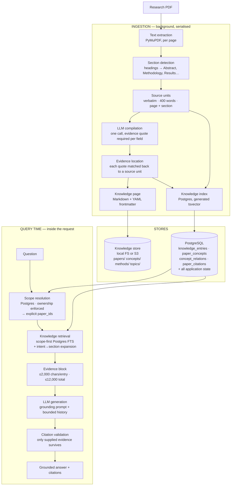

# SAIRA — Knowledge Architecture (LLM-Wiki / OKF)

How a research paper becomes something the assistant can answer from, and how
an answer stays traceable to the paper it came from.

This replaced a GraphRAG design. The previous architecture is documented in
§7 for comparison, because several of its properties were deliberately kept
and it is worth being explicit about which.

---

## 1. The shape of it



**No graph database. No embedding model. No vector store.** One relational
database, one blob store, one LLM provider.

---

## 2. Knowledge representation

Each paper compiles to one Markdown page in the knowledge store:

```
knowledge/
├── index.md
├── papers/
│   └── <paper-uuid>.md
├── concepts/
├── methods/
└── topics/
```

A page is YAML frontmatter plus readable sections:

```markdown
---
paper_id: 09ab33ea-7b9f-4230-8d3c-03f4b47b783e
title: "Ragas: Automated Evaluation of Retrieval Augmented Generation"
authors: []
year: 2023
venue: "arXiv"
source_document: "https://arxiv.org/pdf/2309.15217"
topics: ["Evaluation of NLP systems", "Question answering"]
methods: ["Ragas framework", "WikiEval dataset"]
concepts: ["faithfulness", "answer relevance", "context relevance"]
source_units: 27
---

# Ragas: Automated Evaluation of Retrieval Augmented Generation

## Abstract

We introduce Ragas as a framework for the automated assessment of RAG pipelines.

> To address these issues, in this paper we present Ragas, a framework for the automated assessment

— source page(s): 1

## Research Problem

Existing evaluation of RAG relies on reference answers or LM probabilities…

> we focus on settings where reference answers may not be available

— source page(s): n/a _(unverified — quote not located in source)_
```

Sections rendered, in order: Abstract, Research Problem, Key Contributions,
Methodology, Dataset, Experiments, Results, Limitations, then Key Concepts,
Methods Used, Topics, and Evidence / Source References.

The page is the portable artefact. Postgres holds only a derived index over
it, which is rebuildable — losing the index costs a reindex, not the
knowledge.

---

## 3. Grounding: why this is not a summariser

This is the part that matters most, and the part a "simpler architecture"
most easily loses.

**Every compiled field must carry a verbatim quote**, and the compiler
locates that quote in the paper's own extracted text before storing the
field. A quote that cannot be found does not silently pass:

| Outcome | Stored? | `provenance.verified` | Shown as |
|---|---|---|---|
| Quote found in a source unit | yes | `true` | normal, with page numbers |
| Quote not found anywhere | yes | `false` | `UNVERIFIED` in the prompt, "_(unverified)_" on the page |

Unverified entries are still retrievable — suppressing them would hide that
the compiler produced something questionable — but they are labelled in the
evidence block the model sees, so the model can weigh them, and labelled on
the page a human reads.

**Only `source` entries are verbatim.** They carry the paper's own words,
their page number, and their detected section. They are the primary evidence
and are weighted above compiled prose in ranking.

**Provenance shape** (`knowledge_entries.provenance`, JSONB):

```json
{
  "source_file": "https://arxiv.org/pdf/2309.15217",
  "page": 2,
  "section": "Methodology",
  "source_text": "We consider a standard RAG setting, where given a question q…",
  "evidence_keys": ["09ab33ea-…::source::7"],
  "verified": true
}
```

"Where did this come from?" is answerable for every stored claim.

---

## 4. Retrieval

`knowledge_retriever.KnowledgeRetriever` is the seam. Nothing above it knows
that the implementation is Postgres full-text search.

```python
class KnowledgeRetriever(ABC):
    async def search(db, query, paper_ids, top_k, kinds) -> list[KnowledgeHit]
    async def search_paper(db, query, paper_id, top_k, kinds)     # Paper Chat
    async def search_project(db, query, paper_ids, top_k, kinds)  # Project Chat
```

### Ranking

`ts_rank_cd(search_vector, query, 32)` — the `32` flag normalises to
`rank/(rank+1)`, so scores land in `[0, 1)`, the same shape cosine similarity
had. The tsvector is a **generated column**, weighted title (A) > section (B)
> body (C), so it can never drift from the text.

Two multipliers are applied after ranking:

| Factor | Values | Why |
|---|---|---|
| Entry kind | source 1.0, compiled 0.95, concept/method 0.85, topic 0.75 | At equal relevance, prefer the paper's own words |
| Section | References 0.25, Acknowledgements 0.3, Appendix 0.7, else 1.0 | Bibliographies are dense in exactly the terms a question uses. Before this, a reference list ranked **first** on every question |

### Query construction

Terms are OR-ed, not AND-ed. `websearch_to_tsquery` ANDs, which returns
nothing for any question longer than a few words — the failure mode that
makes people conclude keyword search "doesn't work" for RAG. `ts_rank_cd`
rewards match density, so on-topic entries still rank first.

### Intent → section expansion

A short question is expanded onto the section names its intent implies:

| Question contains | Also matches sections |
|---|---|
| problem, solve, motivation, contribution | Introduction, Abstract |
| method, approach, architecture, technique | Methodology |
| dataset, data, corpus, benchmark | Dataset, Experiments |
| result, finding, performance, accuracy | Results |
| limitation, weakness, drawback | Limitations, Discussion, Conclusion |
| conclusion, future | Conclusion |

**This exists because of a measured failure.** "What problem does this paper
solve?" retrieved *nothing*: every content word in it is a stopword or absent
from the paper's vocabulary — papers state their problem, they do not use the
word "problem". Expansion applies only below 5 content terms, so a specific
question is never diluted.

This is the honest answer to "does keyword retrieval need embeddings?" — it
needed *something*, and mapping intent onto section metadata the compiler
already produces is far cheaper than an embedding model, needs no re-indexing
when it changes, and fails safe (at worst the reader gets the Introduction).

### Scope

Two independent barriers, both tested:

1. **SQL**: `WHERE ke.paper_id = ANY(:paper_ids)` inside the ranked query, so
   top-k is computed *within* scope. Ranking globally and filtering afterwards
   would silently return fewer than *k*.
2. **Python**: any row outside the scope is dropped and logged at ERROR.

The scope itself is always resolved server-side from the database using the
caller's `user_id` (`retrieval_service.resolve_paper_scope` /
`resolve_project_scope`). No request body supplies a scope.

---

## 5. Paper Chat and Project Chat

Both surfaces share one retrieval path and one grounding policy; they differ
only in the `RetrievalScope` handed in.

| | Paper Chat | Project Chat |
|---|---|---|
| Scope | exactly one paper | every paper in the verified project |
| `top_k` | `RAG_TOP_K_PAPER` (5) | `RAG_TOP_K_PROJECT` (10) |
| Endpoint | `POST /chat/sessions/{id}/messages` | `POST /projects/{id}/ai/chat` |
| Ephemeral mode | yes — unsaved papers, nothing persisted | n/a |
| History | ≤ `RAG_MAX_HISTORY_MESSAGES` (6), bounded centrally | same |

Paper Chat cannot reach another paper: its scope list contains exactly one
ID, and both scope barriers apply.

**Citation validation** (`ai_router.answer_scoped`) resolves every
`evidence_id` the model returns against the chunks that actually fit the
evidence budget. An invented id is dropped and logged. A citation therefore
always points at a real entry on a real page.

**Empty retrieval is reported, not improvised.** No evidence → the grounding
prompt makes the model abstain. An empty project answers "This project has no
papers yet."

---

## 6. Ingestion

```
acquire PDF → compile knowledge → persist status
```

PDF acquisition is unchanged from the previous architecture: URL resolved
from a trusted identifier, validated (status, content-type, `%PDF-` magic)
before download, 100 MB cap. The state machine is unchanged, so the
frontend's polling contract still holds:

```
not_indexed → queued → downloading_pdf → indexing → indexed
                                      ↘ pdf_unavailable   (acquisition)
                                      ↘ failed            (processing)
```

**Degradation.** If the LLM call fails, the paper is still marked `indexed`
with the reason recorded — its verbatim source text is indexed and it is
fully answerable, just without a compiled overview. `GET
/papers/{id}/indexing-status` reports `degraded: true` and `can_retry: true`
so the page can be rebuilt later. (This was a bug: only `failed` papers used
to be retryable, so one provider outage cost a paper its wiki page forever.)

**Serialisation.** `KNOWLEDGE_COMPILE_CONCURRENCY` (default 1) gates
compilation. The LLM rate limit is an account-wide resource — measured, two
concurrent compilations on an 8,000 TPM tier both returned truncated JSON,
while the same two run in sequence both succeeded.

**Budgets.** `KNOWLEDGE_COMPILE_MAX_CHARS` (6,000) and
`KNOWLEDGE_COMPILE_MAX_TOKENS` (5,000) must together fit the provider's
per-minute budget *including* the system prompt and reserved output. Source
units are selected by section priority, not document order, so results and
limitations are reachable within budget; back matter is skipped entirely.

---

## 7. What changed from GraphRAG, and what did not

| | Before | After |
|---|---|---|
| Chunking | 500 words / 50 overlap, per page | 400 words / 50 overlap, **per section** |
| Representation | chunk text + 384-d vector | verbatim source units + compiled Markdown page |
| Embeddings | `all-MiniLM-L6-v2` in-process (torch, 537 MB) | **none** |
| Vector store | Neo4j `:Chunk.embedding` | **none** |
| Ranking | `vector.similarity.cosine` scan in Cypher | `ts_rank_cd` over a GIN-indexed tsvector |
| Concept graph | Neo4j `:Concept` nodes + `HAS_CONCEPT` | `paper_concepts` + `concept_relations` |
| Citation graph | Neo4j `:CITES` | `paper_citations` |
| Project citation graph | **fabricated** (year-sorted fake edges + two invented nodes) | real citation edges, empty when none synced |
| Databases at runtime | PostgreSQL + Neo4j | PostgreSQL |

**Kept deliberately:**

- Scope-first ranking, and server-side scope resolution.
- Defence-in-depth scope filtering after the query.
- Citation validation against supplied evidence only.
- The evidence budget returning *the chunks that fit*, so a citation to
  budget-dropped evidence is rejected.
- The indexing state machine and its acquisition/processing distinction.
- Concept canonicalization (alias folding, stopword rejection, evidence
  requirement) — reused as pure functions from `concept_service`.
- `RetrievalScope`, `RetrievedChunk`, `RetrievalResult` and the chat schemas,
  so the API contract and the frontend did not move. `chunk_id` now holds
  `KnowledgeEntry.entry_key`.

**Removed:** `neo4j_service.py`, `neo4j_client.py`, `run_migrations.py`,
`embedding_service.py`, `neo4j_migrations/`, the `neo4j` and
`sentence-transformers` dependencies (and with them torch), and the Neo4j
service from `docker-compose.yml`.

### Is vector search still needed?

Not at this corpus size, on the evidence gathered. Keyword retrieval plus
section expansion answers generic and specific questions on real papers. The
`KnowledgeRetriever` interface is the seam to add semantic search behind if
evaluation later shows otherwise — nothing above it would change.

The honest caveat: this was validated on a small corpus. Keyword retrieval
degrades on paraphrase ("how does it avoid overfitting?" against a paper that
only says "regularisation") in a way dense retrieval does not, and section
expansion only covers intents that map to a section.

---

## 8. Data model

| Table | Holds |
|---|---|
| `knowledge_entries` | one row per retrievable unit: `entry_key`, `kind` (source/compiled/concept/method/topic), `section`, `body`, `page`, `provenance`, generated `search_vector` |
| `paper_concepts` | a concept/method asserted by one paper: `concept_key` (shared across papers), `name`, `evidence`, `pages`, `entry_keys` |
| `concept_relations` | concept→concept edge asserted by one paper |
| `paper_citations` | citation edge; external works are denormalized, never inserted into `papers` |

`entry_key` is deterministic — `{paper_id}::{kind}::{ordinal}` — so
recompiling replaces rather than accumulates, and a citation issued last week
still resolves. Persistence is delete-then-insert per paper: a recompilation
can produce fewer units, and surplus rows would keep matching searches.

---

## 9. Configuration

| Variable | Default | Purpose |
|---|---|---|
| `KNOWLEDGE_STORE_BACKEND` | `local` | `local` \| `s3` |
| `KNOWLEDGE_ROOT` | `knowledge` | local store root |
| `KNOWLEDGE_S3_BUCKET` / `_PREFIX` | — / `knowledge` | S3 store |
| `KNOWLEDGE_COMPILE_MAX_CHARS` | `6000` | source text per compilation call |
| `KNOWLEDGE_COMPILE_MAX_TOKENS` | `5000` | output reserved per call |
| `KNOWLEDGE_COMPILE_CONCURRENCY` | `1` | simultaneous compilations |
| `LLM_PROVIDER` | `groq` | `groq` \| `bedrock` |
| `RAG_TOP_K_PAPER` / `_PROJECT` | `5` / `10` | retrieval breadth |
| `RAG_MAX_CHUNK_CHARS` | `2000` | per-entry evidence cap |
| `RAG_MAX_CONTEXT_CHARS` | `12000` | total evidence cap |
| `RAG_MAX_HISTORY_MESSAGES` | `6` | conversation memory bound |

---

## 10. Operations

```bash
cd backend

# Papers indexed by the old pipeline have no compiled knowledge. Reset them so
# they recompile on next use (free), optionally warming the most-used first.
venv/Scripts/python.exe scripts/recompile_knowledge.py --dry-run
venv/Scripts/python.exe scripts/recompile_knowledge.py
venv/Scripts/python.exe scripts/recompile_knowledge.py --recompile 5

# Drop knowledge for papers nobody saved (TTL cleanup).
venv/Scripts/python.exe scripts/prune_ephemeral_papers.py --dry-run
```
